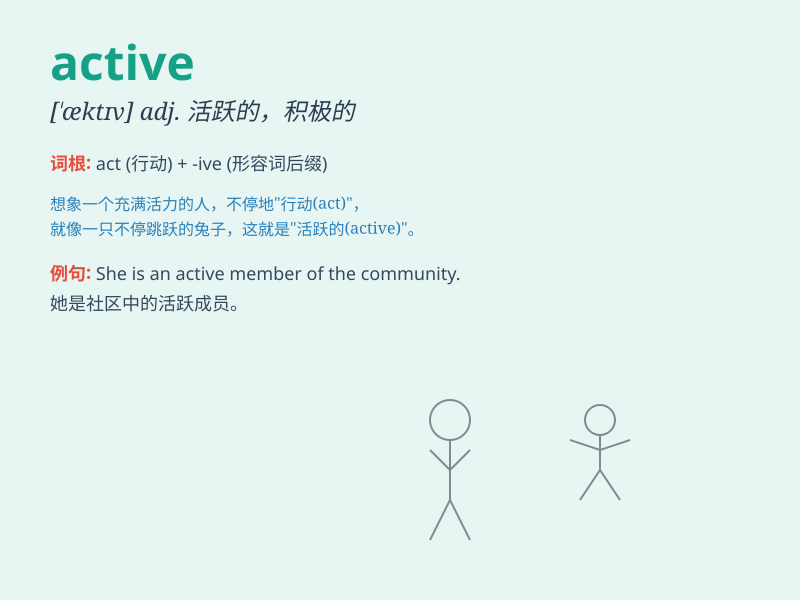

## active

**英音:** _[\'æktɪv]_ **美音:** _[\'æktɪv]_

**译义:**
*adj.积极的,能起作用的,现行的,[语法]主动的,活动的,活跃的,活性的;n.[语法]
主动语态,积极分子*

### 短语

+ **active volcano:** _活火山_

+ **active participation:** _积极参与_

+ **active ingredient:** _有效成分；活性成分_

+ **active service:** _现役；现役服务_

+ **be active in:** _积极参加；在......方面活跃_

### 例句

#### 例句1

> **She has an active social life.**

**中文翻译:** 她有着活跃的社交生活。

**单词释义:** 活跃的

#### 例句2

> **The child is very active and can\'t sit still for a moment.**

**中文翻译:** 这孩子非常好动，一刻也坐不住。

**单词释义:** 好动的

#### 例句3

> **We need to take active measures to protect the environment.**

**中文翻译:** 我们需要采取积极的措施来保护环境。

**单词释义:** 积极的

### 背诵小故事

> Once upon a time, there was a little rabbit. It was always running
and jumping, never staying still. It was so active that it made all the
other animals admire its energy. This little rabbit showed us what
\'active\' means.

**从前，有一只小兔子。它总是跑啊跳啊，从不静止不动。它如此活跃，让其他所有动物都羡慕它的精力。这只小兔子向我们展示了'active'的意思。**

### 图义

