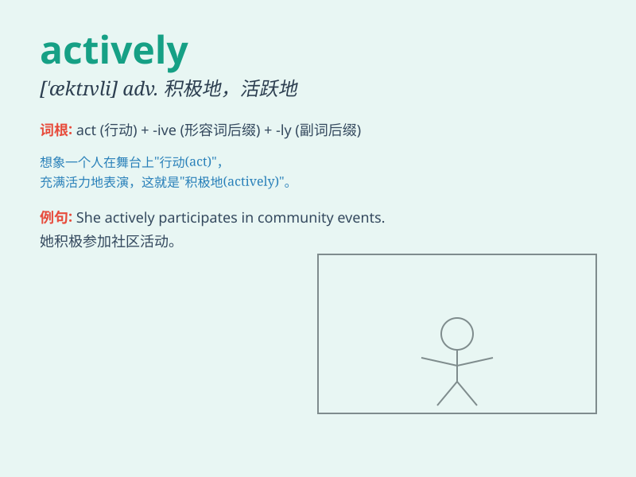

## actively

**英音:** _[\'æktɪvli]_ **美音:** _[\'æktɪvli]_

**译义:** *adv.活跃地,积极地*

### 短语

+ **actively participate:** _积极参与_

+ **actively seek:** _积极寻求_

+ **actively promote:** _积极推动_

+ **actively engage:** _积极参与；积极从事_

+ **actively involve:** _积极涉及；积极参与_

### 例句

#### 例句1

> **She actively participates in community activities.**

**中文翻译:** 她积极参与社区活动。

**单词释义:** 积极地

#### 例句2

> **The company is actively seeking new business opportunities.**

**中文翻译:** 这家公司正在积极寻找新的商业机会。

**单词释义:** 积极地

#### 例句3

> **He actively defended his point of view during the debate.**

**中文翻译:** 在辩论中，他积极地捍卫自己的观点。

**单词释义:** 积极地

### 背诵小故事

> A little ant was actively looking for food. It climbed over hills and
crossed rivers, never stopping. Finally, it found a big piece of cake
and shared it with its friends. \'Actively\' means with a lot of energy
and enthusiasm.

**一只小蚂蚁正在积极地寻找食物。它翻山越岭，过河穿流，从未停歇。最后，它找到了一大块蛋糕，并和朋友们分享。'actively'意思是充满活力和热情地。**

### 图义

