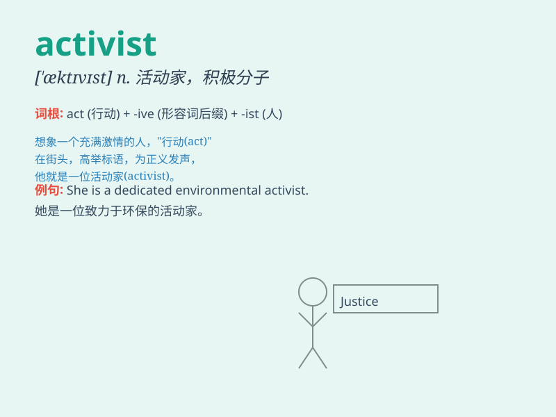

## activist

**英音:** _[\'æktɪvɪst]_ **美音:** _[\'æktɪvɪst]_

**译义:** *n.激进主义分子,行动主义分子*

### 短语

+ **political activist:** _政治活动家_

+ **environmental activist:** _环保活动家_

+ **human rights activist:** _人权活动家_

+ **social activist:** _社会活动家_

+ **peace activist:** _和平活动家_

### 例句

#### 例句1

> **She is a well-known environmental activist.**

**中文翻译:** 她是一位著名的环保活动家。

**单词释义:** 活动家；积极分子

#### 例句2

> **The activist led a protest against the new law.**

**中文翻译:** 这位活动家领导了一场反对新法律的抗议活动。

**单词释义:** 活动家；积极分子

#### 例句3

> **He has been an activist for social justice for many years.**

**中文翻译:** 他多年来一直是社会正义的积极分子。

**单词释义:** 积极分子；活动家

### 背诵小故事

> A young man was always passionate about social justice. He actively
participated in protests and campaigns, becoming known as an activist.
His efforts made a difference in the community.

**一个年轻人总是对社会正义充满热情。他积极参加抗议和活动，成为了一名活跃分子。他的努力给社区带来了改变。**

### 图义

