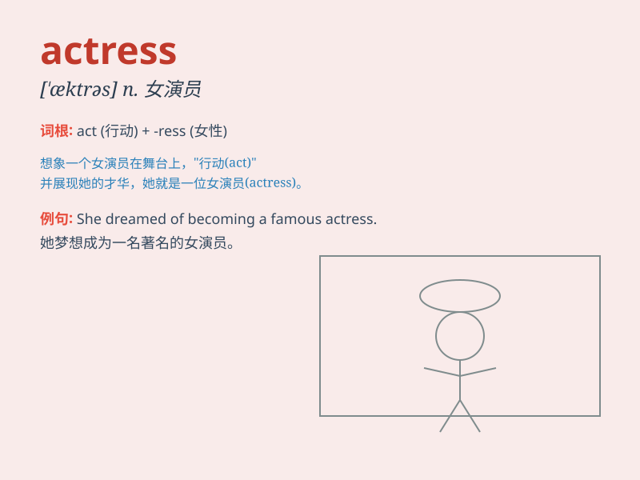

## actress

**英音:** _[ˈæktrəs]_ **美音:** _[ˈæktrəs]_

**译义:** *n.女演员*

### 短语

+ **leading actress:** _女主角_

+ **famous actress:** _著名女演员_

+ **young actress:** _年轻女演员_

+ **talented actress:** _有才华的女演员_

+ **up-and-coming actress:** _崭露头角的女演员_

### 例句

#### 例句1

> **The actress gave a stunning performance in the play.**

**中文翻译:** 这位女演员在剧中的表演令人惊叹。

**单词释义:** 女演员

#### 例句2

> **She is a famous actress known for her versatile roles.**

**中文翻译:** 她是一位以出演多种角色而闻名的著名女演员。

**单词释义:** 女演员

#### 例句3

> **The young actress has great potential in the entertainment
industry.**

**中文翻译:** 这位年轻的女演员在娱乐圈有很大的潜力。

**单词释义:** 女演员

### 背诵小故事

> One day, a little girl dreamed of becoming an actress. She practiced
acting every day, imagining herself on the big stage. Finally, her hard
work paid off and she became a famous actress.

**有一天，一个小女孩梦想成为一名女演员。她每天都练习表演，想象自己站在大舞台上。最终，她的努力得到了回报，她成为了一位著名的女演员。**

### 图义

