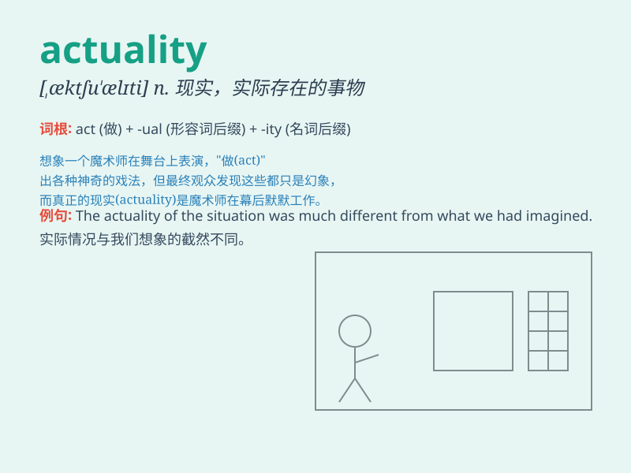

## actuality

**英音:** _[æktjʊ\'ælɪtɪ; -tʃʊ-]_ **美音:**
_[,æktʃu\'æləti]_

**译义:** *n.实在,现状*

### 短语

+ **in actuality:** _实际上；事实上_

+ **as a matter of actuality:** _事实上；实际上_

+ **reality and actuality:** _现实与实际_

+ **state of actuality:** _实际状态_

+ **contrast between theory and actuality:**
_理论与实际之间的对比_

### 例句

#### 例句1

> **In actuality, the situation is much more complex than it
appears.**

**中文翻译:** 实际上，情况比看起来要复杂得多。

**单词释义:** 实际上

#### 例句2

> **The plan sounds good on paper, but in actuality, it\'s difficult
to implement.**

**中文翻译:** 这个计划在纸面上听起来不错，但实际上很难实施。

**单词释义:** 实际上

#### 例句3

> **In actuality, she is a very kind person.**

**中文翻译:** 实际上，她是一个非常善良的人。

**单词释义:** 实际上

### 背诵小故事

>
想象一下，探险家在寻找传说中的宝藏。历经千辛万苦，最终他找到了真实存在的（actuality）宝藏地点，不是幻想，而是实实在在的现实。这就是
actuality 的体现。

**想象探险家找到真实存在的宝藏地点来辅助记忆【actuality】意为现实、实际情况**

### 图义

