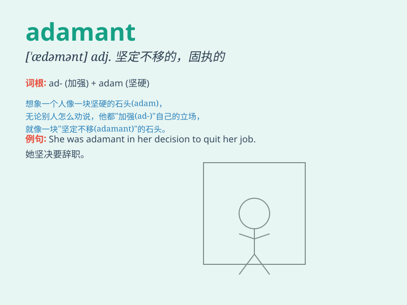

## adamant

**英音:** _[\'ædəm(ə)nt]_ **美音:** _[\'ædəmənt]_

**译义:** *adj.坚硬的*

### 短语

+ **be adamant about:** _坚决主张；坚决要求_

+ **adamant opposition:** _坚决反对_

+ **remain adamant:** _保持坚决_

+ **adamant stance:** _坚决的立场_

+ **adamant determination:** _坚定的决心_

### 例句

#### 例句1

> **He was adamant that he would not change his mind.**

**中文翻译:** 他坚决表示他不会改变主意。

**单词释义:** 坚决的；坚定不移的

#### 例句2

> **The boss was adamant about the new policy and wouldn\'t listen to
any objections.**

**中文翻译:** 老板对新政策坚定不移，不听任何反对意见。

**单词释义:** 坚决的；强硬的

#### 例句3

> **She remained adamant in her decision to quit the job.**

**中文翻译:** 她辞职的决定仍然坚定不移。

**单词释义:** 坚决的；毫不动摇的

### 背诵小故事

> Adam 是个固执的人，无论别人怎么劝，他都坚决不改主意。大家都说他是
adamant。后来，只要有人特别坚决，大家就会想到 Adam，也就记住了 adamant
这个表示坚决的、坚定不移的单词。

**Adam 是个固执的人，不管别人怎么劝都坚决不改主意。大家用 adamant
形容这种坚决的态度。只要有人特别坚决，大家就会想到
Adam，从而记住这个单词，表示坚决的、坚定不移的。**

### 图义

