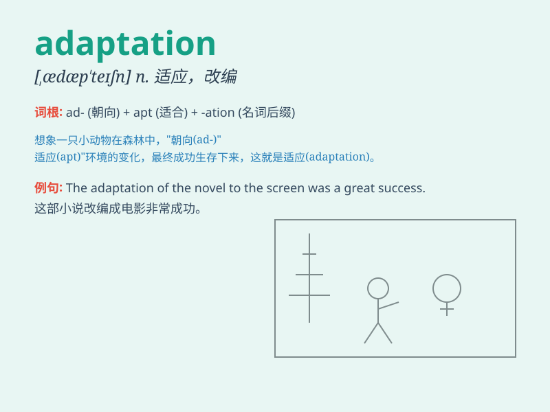

## adaptation

**英音:** _[ædəp\'teɪʃ(ə)n]_ **美音:** _[,ædæp\'teʃən]_

**译义:** *n.适应,改编,改写本*

### 短语

+ **environmental adaptation:** _环境适应_

+ **cultural adaptation:** _文化适应_

+ **genetic adaptation:** _遗传适应_

+ **adaptation process:** _适应过程_

+ **adaptation strategy:** _适应策略_

### 例句

#### 例句1

> **The film is an adaptation of a famous novel.**

**中文翻译:** 这部电影是一部著名小说的改编版。

**单词释义:** 改编

#### 例句2

> **The adaptation of plants to the desert environment is
remarkable.**

**中文翻译:** 植物对沙漠环境的适应能力非常显著。

**单词释义:** 适应

#### 例句3

> **His quick adaptation to the new job impressed his colleagues.**

**中文翻译:** 他对新工作的快速适应给同事们留下了深刻的印象。

**单词释义:** 适应

### 背诵小故事

> A little mouse needed to find a new home. It had to make many changes
to adapt to the new environment. This process of changing and adjusting
was its adaptation.

**一只小老鼠需要找一个新家。它不得不做出许多改变来适应新环境。这个改变和调整的过程就是它的适应。**

### 图义

