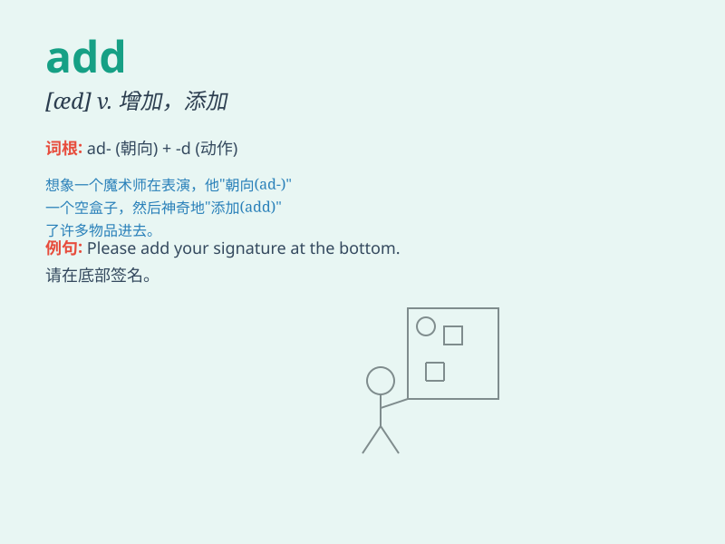

## add

**英音:** _[æd]_ **美音:** _[æd]_

**译义:**
*vt.增加,添加,计算\...总和,补充说,又说;vi.加,加起来,增添,做加法*

### 短语

+ **add up:** _加起来；总计_

+ **add to:** _增加；增添_

+ **add in:** _把...包括在内_

+ **add up to:** _总计达；意味着_

+ **add on:** _附加；加上_

### 例句

#### 例句1

> **If you add two and three, you get five.**

**中文翻译:** 如果你把二和三相加，你会得到五。

**单词释义:** 做加法；加

#### 例句2

> **Please add some salt to the soup.**

**中文翻译:** 请给汤加点盐。

**单词释义:** 增加；添加

#### 例句3

> **His story just adds to my confusion.**

**中文翻译:** 他的故事只是增加了我的困惑。

**单词释义:** 增添；补充

### 背诵小故事

> One day, Tom had 5 apples. Then his friend gave him 3 more apples.
Tom needed to add the new apples to his collection. So, he counted and
found he had 8 apples in total.

**一天，汤姆有 5 个苹果。然后他的朋友又给了他 3
个苹果。汤姆需要把新的苹果加到他的收藏中。所以，他数了数，发现他总共有 8
个苹果。**

### 图义

