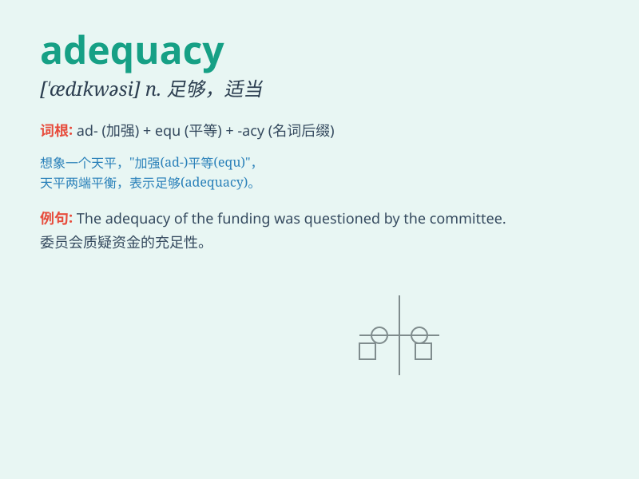

## adequacy

**英音:** _[\'ædɪkwəsɪ]_ **美音:** _[\'ædəkwəsi]_

**译义:** *n.适当,足够*

### 短语

+ **adequacy of resources:** _资源的充足性_

+ **test for adequacy:** _充足性测试_

+ **adequacy of performance:** _性能的充分性_

+ **assess adequacy:** _评估充分性_

+ **adequacy of measures:** _措施的充分性_

### 例句

#### 例句1

> **The adequacy of the food supply was a major concern during the
disaster.**

**中文翻译:** 在灾难期间，食物供应是否充足是一个主要的担忧。

**单词释义:** 充足；适当

#### 例句2

> **We need to assess the adequacy of our security measures.**

**中文翻译:** 我们需要评估我们安全措施的适当性。

**单词释义:** 适当；足够

#### 例句3

> **The adequacy of his explanation failed to convince us.**

**中文翻译:** 他的解释不够充分，未能说服我们。

**单词释义:** 充分；足够

### 背诵小故事

> A poor man was always worried about his adequacy of food. One day, he
found a hidden storehouse full of grains, ensuring his adequacy. From
then on, he knew adequacy means having enough of what is needed.

**一个穷人总是担心食物是否充足。有一天，他发现了一个装满谷物的隐藏仓库，确保了食物充足。从那以后，他知道了adequacy意味着有足够所需的东西。**

### 图义

