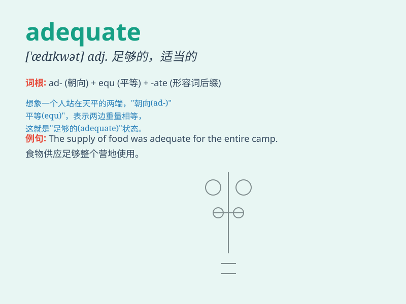

## adequate

**英音:** _[ˈædɪkwət]_ **美音:** _[ˈædɪkwət]_

**译义:** *adj. 足够的，适当的，胜任的*

### 短语

+ **adequate for:** _对\...\...足够；适合于_

+ **adequate to:** _胜任；足以；适合_

+ **be adequate:** _是足够的；合适的_

+ **adequate supply:** _充足供应_

+ **adequate protection:** _充分保护；足够防护_

### 例句

#### 例句1

> **The food supply was adequate for the entire week.**

**中文翻译:** 食物供应足以维持整整一周。

**单词释义:** 足够的；充分的

#### 例句2

> **She has adequate skills to handle the job.**

**中文翻译:** 她有足够的技能来处理这份工作。

**单词释义:** 足够的；胜任的

#### 例句3

> **The lighting in this room is adequate for reading.**

**中文翻译:** 这个房间的照明足以用来阅读。

**单词释义:** 足够的；适当的

### 背诵小故事

>
想象一下，在一个贫困的小镇，食物供应总是不足。直到有一天，一辆装满物资的卡车到来，提供的食物刚好足够满足所有人的需求，这就是'adequate'，充足适当的。

**想象在贫困小镇食物供应不足，直到卡车带来刚好足够的食物，以此来辅助记忆'adequate'表示充足适当的意思。**

### 图义

