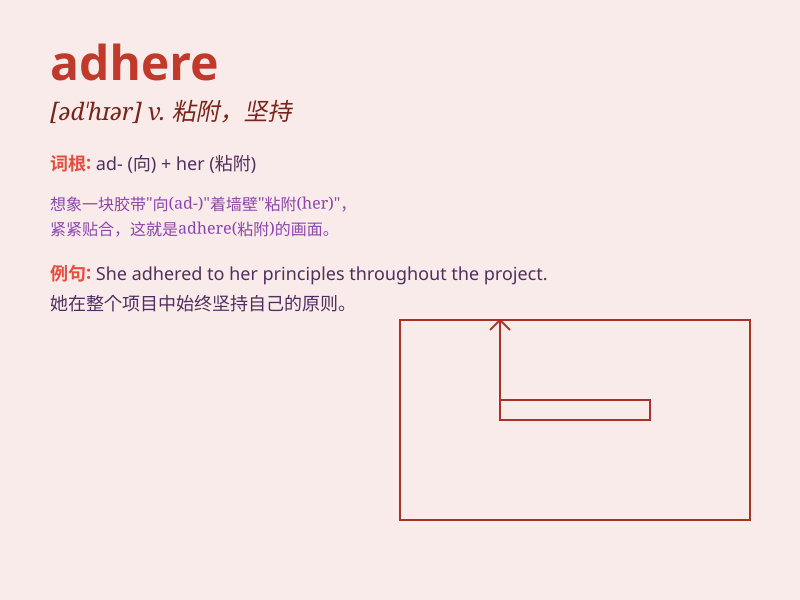

## adhere

**英音:** _[əd\'hɪə]_ **美音:** _[əd\'hɪr]_

**译义:** *vi.粘附,胶着,坚持v.坚持*

### 短语

+ **adhere to:** _坚持；粘附；遵循_

+ **adhere closely:** _紧密粘附；紧密遵循_

+ **adhere strictly:** _严格遵守；严格粘附_

+ **adhere firmly:** _坚定地粘附；坚定地坚持_

+ **adhere religiously:** _虔诚地遵循；虔诚地坚持_

### 例句

#### 例句1

> **The stickers adhere firmly to the surface.**

**中文翻译:** 这些贴纸牢牢地粘在表面上。

**单词释义:** 粘着；附着

#### 例句2

> **We must adhere to the rules of the game.**

**中文翻译:** 我们必须遵守游戏规则。

**单词释义:** 遵守；坚持

#### 例句3

> **She adheres to her principles no matter what happens.**

**中文翻译:** 无论发生什么，她都坚守自己的原则。

**单词释义:** 坚守；坚信

### 背诵小故事

>
想象你在爬山，道路泥泞湿滑，但你紧紧地贴着（adhere）山壁，一步一步往上爬，因为你知道只有紧贴着山壁才能保证安全到达山顶。

**想象在爬山时紧紧贴着山壁的情景来记住adhere（坚持；粘附）这个单词**

### 图义

