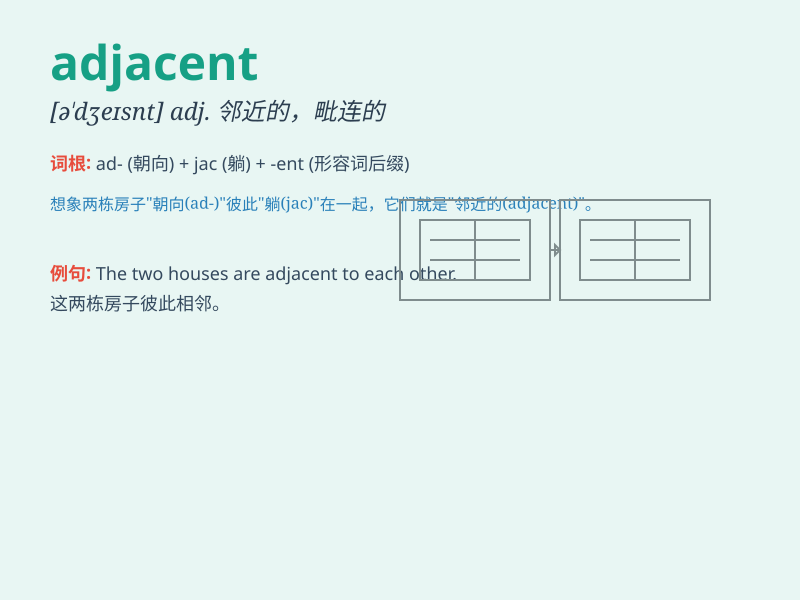

## adjacent

**英音:** _[ə\'dʒeɪs(ə)nt]_ **美音:** _[ə\'dʒesnt]_

**译义:** *adj.邻近的,接近的*

### 短语

+ **adjacent room:** _相邻的房间_

+ **adjacent building:** _相邻的建筑物_

+ **adjacent field:** _相邻的田地_

+ **adjacent street:** _相邻的街道_

+ **adjacent town:** _相邻的城镇_

### 例句

#### 例句1

> **The hotel is adjacent to the railway station.**

**中文翻译:** 这家酒店毗邻火车站。

**单词释义:** 毗邻；邻近

#### 例句2

> **Our seats were adjacent at the cinema.**

**中文翻译:** 在电影院我们的座位相邻。

**单词释义:** 相邻的

#### 例句3

> **The two plots of land are adjacent to each other.**

**中文翻译:** 这两块地彼此相邻。

**单词释义:** 相邻；毗连

### 背诵小故事

> A brave knight was looking for a hidden treasure. He found a cave
adjacent to a big oak tree. It was right next to it, and he knew his
adventure was about to begin.

**一位勇敢的骑士正在寻找隐藏的宝藏。他发现了一个紧邻着一棵大橡树的洞穴。就在它旁边，他知道自己的冒险即将开始。**

### 图义

