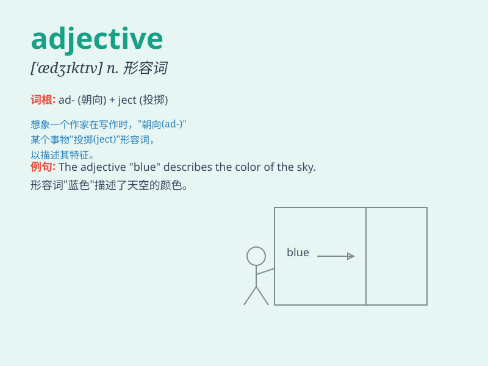

## adjective

**英音:** _[\'ædʒɪktɪv]_ **美音:** _[\'ædʒɪktɪv]_

**译义:** *n.形容词*

### 短语

+ **attributive adjective:** _定语形容词_

+ **predicative adjective:** _表语形容词_

+ **qualifying adjective:** _限定性形容词_

+ **descriptive adjective:** _描述性形容词_

+ **proper adjective:** _专有形容词_

### 例句

#### 例句1

> **The beautiful flower attracted many bees.**

**中文翻译:** 这朵美丽的花吸引了许多蜜蜂。

**单词释义:** 美丽的，形容词，用于修饰名词\'flower\'，描述花的特征

#### 例句2

> **He is a tall man.**

**中文翻译:** 他是个高个子男人。

**单词释义:** 高的，形容词，形容男人的身高

#### 例句3

> **The smart student answered the question quickly.**

**中文翻译:** 这个聪明的学生很快回答了问题。

**单词释义:** 聪明的，形容词，描绘学生的特质

### 背诵小故事

> One day, a little student asked the teacher, \'What are words that
describe nouns?\' The teacher replied, \'Those are called adjectives,
like beautiful, big, and smart.\' The student understood easily.

**一天，一个小学生问老师：'那些描述名词的词是什么？'老师回答：'那些被称为形容词，比如美丽的、大的、聪明的。'学生一下子就明白了。**

### 图义

