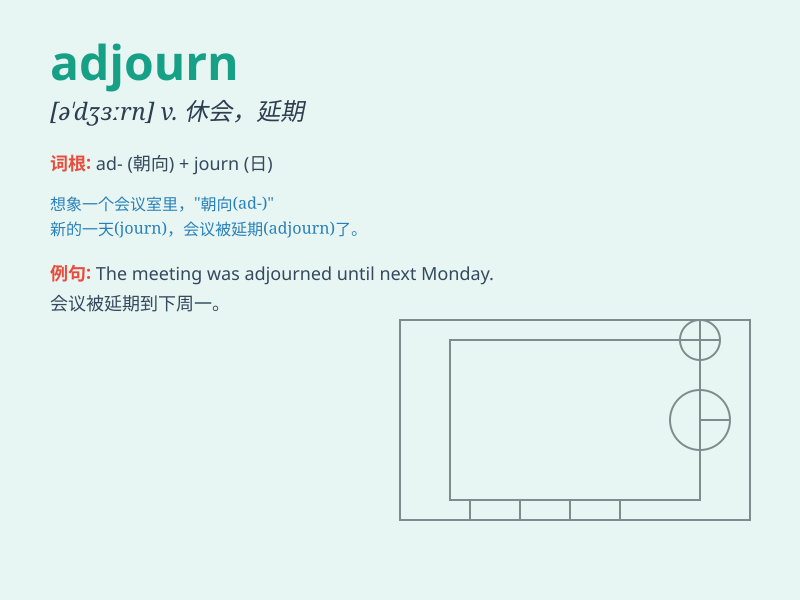

## adjourn

**英音:** _[ə\'dʒɜːn]_ **美音:** _[ə\'dʒɝn]_

**译义:** *vi.延期,休会,换另一 个地方vt.使中止,推迟*

### 短语

+ **adjourn a meeting:** _休会_

+ **adjourn sine die:** _无限期休会_

+ **adjourn to another place:** _移至别处_

+ **adjourn for a break:** _休会休息_

+ **adjourn until tomorrow:** _休会至明天_

### 例句

#### 例句1

> **The meeting was adjourned until next week.**

**中文翻译:** 会议休会到下周。

**单词释义:** 休会；延期

#### 例句2

> **The judge adjourned the court for the day.**

**中文翻译:** 法官宣布法庭当天休庭。

**单词释义:** 休庭；暂停

#### 例句3

> **The committee adjourned the discussion on the matter.**

**中文翻译:** 委员会暂停了对该事项的讨论。

**单词释义:** 暂停；中止

### 背诵小故事

> 想象法庭上，法官觉得案件太复杂，于是大声说：\'adjourn！\'
意思就是现在休庭，大家先离开，之后再继续审理。这就像暂停了当前的活动，等待合适的时候再重新开始。

**想象法庭场景中，法官喊\'休庭\'，来辅助理解\'adjourn\'这个单词，表示暂停活动，之后再继续。**

### 图义

