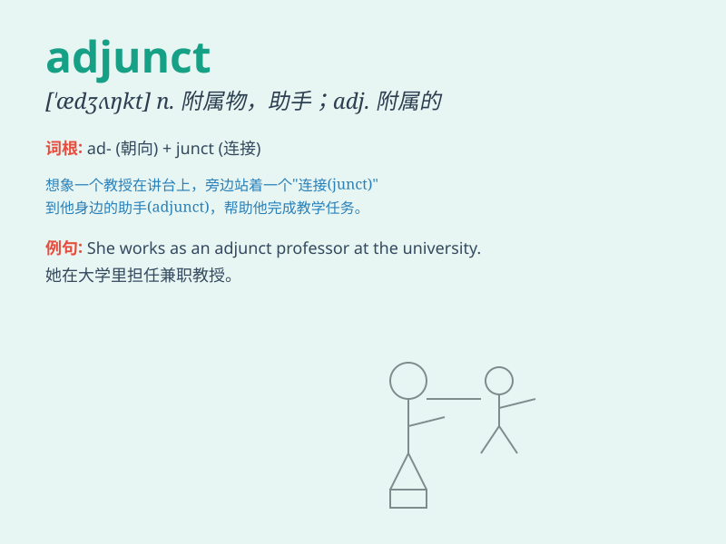

## adjunct

**英音:** _[\'ædʒʌŋ(k)t]_ **美音:** _[\'ædʒʌŋkt]_

**译义:** *n.附件,助手adj.附属的*

### 短语

+ **adjunct professor:** _兼职教授_

+ **adjunct matrix:** _伴随矩阵_

+ **adjunct account:** _附加账户_

+ **adjunct variable:** _辅助变量_

+ **adjunct treatment:** _辅助治疗_

### 例句

#### 例句1

> **The part-time job was an adjunct to his main income.**

**中文翻译:** 这份兼职工作是他主要收入的补充。

**单词释义:** 补充；附属物

#### 例句2

> **In grammar, an adjunct is a word or phrase that adds extra
information to a sentence.**

**中文翻译:** 在语法中，附加语是为句子添加额外信息的单词或短语。

**单词释义:** 附加语；修饰成分

#### 例句3

> **The new building was designed as an adjunct to the existing
complex.**

**中文翻译:** 新大楼被设计为现有建筑群的附属建筑。

**单词释义:** 附属建筑；附属部分

### 背诵小故事

> 想象一下，学校里有一位老师，他不是正式的班主任，只是辅助教学的
adjunct 老师。他帮忙批改作业、辅导学生，是教学团队的补充力量。就像
adjunct 这个词，意思是附属物、附加物。

**想象一位辅助教学的老师来理解 adjunct
这个词，它意为附属物、附加物。**

### 图义

