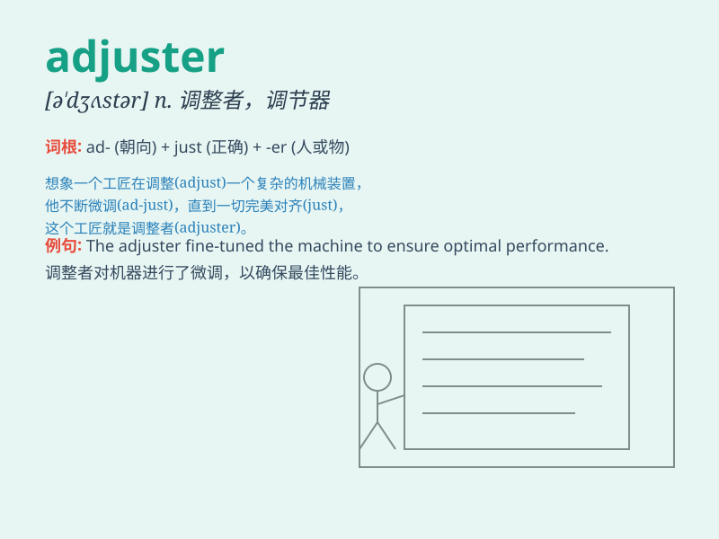

## adjuster

**英音:** _[əˈdʒʌstə]_ **美音:** _[əˈdʒʌstər]_

**译义:** *n.调停者,调节器*

### 短语

+ **voltage adjuster:** _电压调节器_

+ **focus adjuster:** _焦距调节器_

+ **pressure adjuster:** _压力调节器_

+ **speed adjuster:** _速度调节器_

+ **temperature adjuster:** _温度调节器_

### 例句

#### 例句1

> **The adjuster fine-tuned the machine to improve its
performance.**

**中文翻译:** 调节器对机器进行了微调以提高其性能。

**单词释义:** 调节器

#### 例句2

> **The insurance adjuster assessed the damage after the
accident.**

**中文翻译:** 保险理赔员在事故后评估了损失。

**单词释义:** 理赔员

#### 例句3

> **The salary adjuster made some changes to the payment
structure.**

**中文翻译:** 薪酬调整员对薪酬结构做了一些更改。

**单词释义:** 调整员

### 背诵小故事

> There was a skilled adjuster in a factory. He could precisely adjust
the machine to work perfectly. One day, a big problem occurred, but with
his adjustment skills, everything was fixed. Remember, an adjuster makes
things right!

**在一个工厂里有一位技术娴熟的调节器师傅。他能够精准地调试机器使其完美运行。有一天，出现了一个大问题，但凭借他的调试技能，一切都被解决了。记住，adjuster
就是让事物正确的人！**

### 图义

