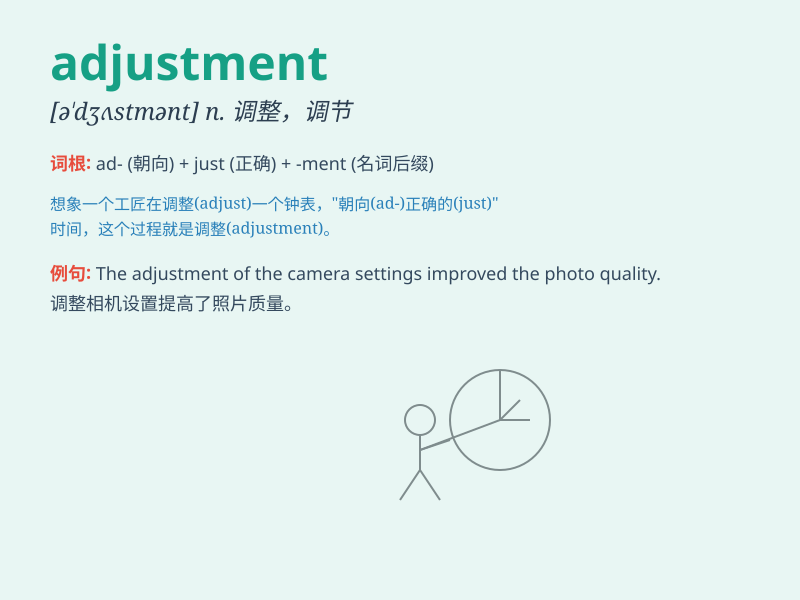

## adjustment

**英音:** _[ə\'dʒʌs(t)m(ə)nt]_ **美音:**
_[ə\'dʒʌstmənt]_

**译义:** *n.调整,调节,调节器*

### 短语

+ **make an adjustment:** _进行调整_

+ **need an adjustment:** _需要调整_

+ **minor adjustment:** _小的调整；细微调整_

+ **major adjustment:** _重大调整_

+ **adjustment process:** _调整过程_

### 例句

#### 例句1

> **The adjustment of the machine took several hours.**

**中文翻译:** 这台机器的调试花了好几个小时。

**单词释义:** 调试；调整

#### 例句2

> **She made a slight adjustment to her hairstyle.**

**中文翻译:** 她对自己的发型做了一点小调整。

**单词释义:** 调整；改变

#### 例句3

> **The company is going through some financial adjustments.**

**中文翻译:** 这家公司正在经历一些财务调整。

**单词释义:** 调整；整顿

### 背诵小故事

>
想象一个机器人，它的行动总是不太准确。后来，工程师们对它的各个部件进行了精细的调整，这个调整的过程就是adjustment。机器人最终变得完美，能出色完成任务。

**想象一个机器人，它的行动不准确，工程师对其部件进行精细调整的过程就是"调整；调节"**

### 图义

