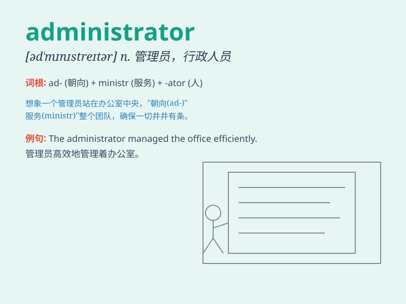

## administrator

**英音:** _[əd\'mɪnɪstreɪtə]_ **美音:**
_[əd\'mɪnɪstretɚ]_

**译义:** *n.管理人,行政官 (Administrator)[计]网络管理员*

### 短语

+ **system administrator:** _系统管理员_

+ **network administrator:** _网络管理员_

+ **database administrator:** _数据库管理员_

+ **school administrator:** _学校管理人员_

+ **hospital administrator:** _医院管理人员_

### 例句

#### 例句1

> **The school administrator is responsible for managing the daily
operations.**

**中文翻译:** 学校的管理人员负责管理日常运作。

**单词释义:** 管理人员

#### 例句2

> **The system administrator ensures the security of the computer
network.**

**中文翻译:** 系统管理员确保计算机网络的安全。

**单词释义:** 管理员

#### 例句3

> **The hospital administrator is dealing with the staff shortage
issue.**

**中文翻译:** 医院的行政管理人员正在处理员工短缺的问题。

**单词释义:** 行政管理人员

### 背诵小故事

>
想象一个大型公司，有个掌控全局、安排一切事务的人，他就是administrator。他决定资源分配、人员调度，就像船长指挥船只一样，让公司有序运转。

**想象一个大型公司中掌控和安排一切事务的人，就像这个单词【administrator】所表示的'管理人员；行政人员'**

### 图义

