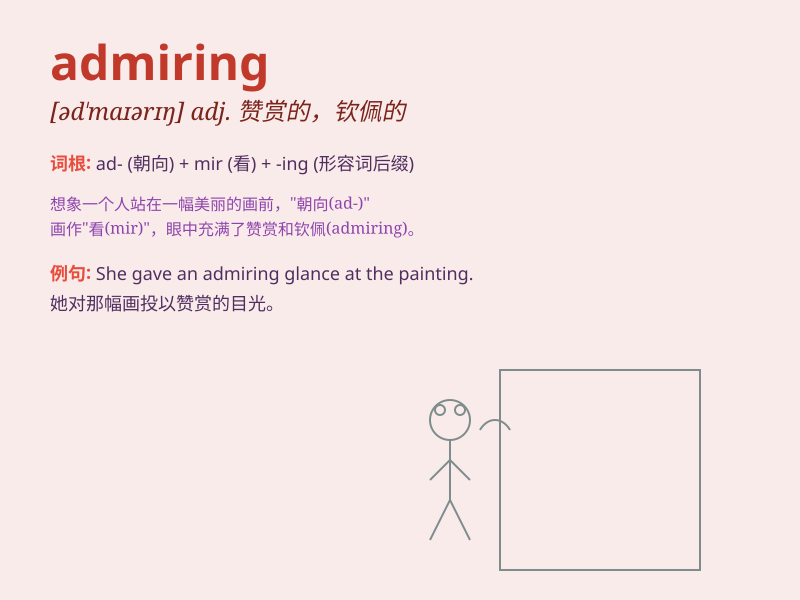

## admiring

**英音:** _[əd\'maɪərɪŋ]_ **美音:** _[əd\'maɪrɪŋ]_

**译义:** *adj.赞赏的,钦佩的*

### 短语

+ **admiring glance:** _赞赏的目光_

+ **admiring comments:** _赞赏的评论_

+ **admiring audience:** _钦佩的观众_

+ **admiring tone:** _赞赏的语气_

+ **admiring expression:** _赞赏的表情_

### 例句

#### 例句1

> **She gave him an admiring look when he finished the
presentation.**

**中文翻译:** 当他完成演示时，她向他投去了钦佩的目光。

**单词释义:** 钦佩的

#### 例句2

> **The tourists had admiring comments about the beautiful
scenery.**

**中文翻译:** 游客们对美丽的风景有赞赏的评价。

**单词释义:** 赞赏的

#### 例句3

> **He received many admiring glances at the party.**

**中文翻译:** 他在聚会上收到了许多羡慕的目光。

**单词释义:** 羡慕的

### 背诵小故事

> Once upon a time, I went to an art exhibition. When I saw a
magnificent painting, my eyes were filled with an admiring look. I
couldn\'t help but praise the artist\'s talent. \'Admiring\' means
having a feeling of respect and approval.

**从前，我去了一个艺术展。当我看到一幅宏伟的画作时，我的眼中充满了赞赏的神情。我忍不住称赞画家的才华。'admiring'意思是怀有尊敬和认可的感觉。**

### 图义

