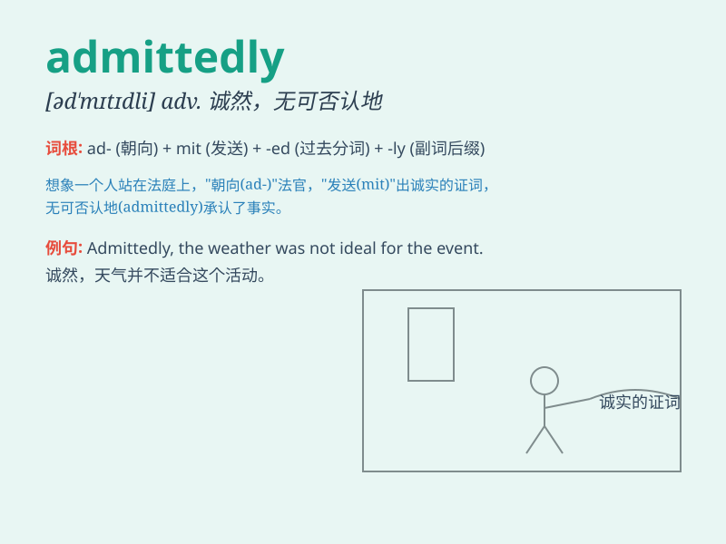

## admittedly

**英音:** _[əd\'mɪtɪdlɪ]_ **美音:** _[əd\'mɪtɪdli]_

**译义:** *adv.公认地,诚然,无可否认的*

### 短语

+ **admittedly true:** _诚然是真的_

+ **admittedly difficult:** _诚然困难_

+ **admittedly so:** _诚然如此_

+ **admittedly wrong:** _诚然错误_

+ **admittedly beautiful:** _诚然美丽_

### 例句

#### 例句1

> **Admittedly, I was wrong about that.**

**中文翻译:** 诚然，在那件事上我错了。

**单词释义:** 诚然；确实；无可否认

#### 例句2

> **Admittedly, the task is difficult, but we should still try our
best.**

**中文翻译:** 不可否认，这项任务很困难，但我们仍应尽力而为。

**单词释义:** 不可否认；诚然

#### 例句3

> **Admittedly, she has made some progress.**

**中文翻译:** 诚然，她取得了一些进步。

**单词释义:** 诚然；确实

### 背诵小故事

> A student was struggling with a difficult exam. Admittedly, he
didn\'t study hard. But after realizing his mistake, he promised to do
better next time. Here, \'admittedly\' means confessing or acknowledging
something, as the student confessed his lack of effort.

**一名学生在一场很难的考试中表现不佳。诚然，他没有努力学习。但在意识到错误后，他承诺下次会做得更好。这里，'admittedly'意思是承认、供认某事，就像这名学生承认自己没有努力。**

### 图义

