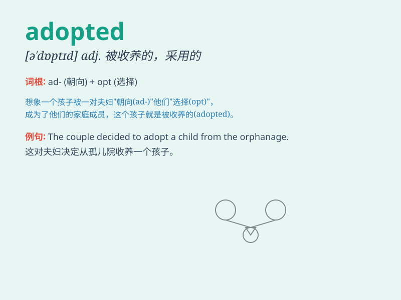

## adopted

**英音:** _[ə\'dɒptɪd]_ **美音:** _[ə\'dɑptɪd]_

**译义:** *adj.被收养的,被采用的*

### 短语

+ **adopted child:** _领养的孩子_

+ **adopted parents:** _养父母_

+ **adopted son:** _养子_

+ **adopted daughter:** _养女_

+ **adopted measures:** _采取的措施_

### 例句

#### 例句1

> **They adopted a child from the orphanage.**

**中文翻译:** 他们从孤儿院领养了一个孩子。

**单词释义:** 领养

#### 例句2

> **The company adopted a new strategy to increase profits.**

**中文翻译:** 公司采用了一种新的策略来增加利润。

**单词释义:** 采用

#### 例句3

> **She adopted a positive attitude towards life.**

**中文翻译:** 她对生活采取了积极的态度。

**单词释义:** 采取

### 背诵小故事

> A little girl was adopted by a kind family. They gave her love and
care. The word \'adopted\' means to take someone else\'s child and make
them your own.

**一个小女孩被一个善良的家庭收养了。他们给了她爱和关怀。单词'adopted'意思是收养（某人），把别人的孩子当作自己的。**

### 图义

