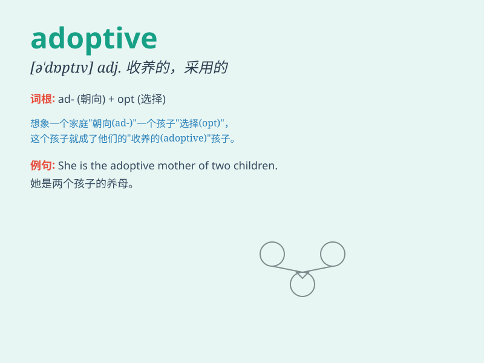

## adoptive

**英音:** _[ə\'dɒptɪv]_ **美音:** _[ə\'dɑptɪv]_

**译义:** *adj.收养关系的,采用的*

### 短语

+ **adoptive parent:** _养父母_

+ **adoptive family:** _领养家庭_

+ **adoptive child:** _被领养的孩子_

+ **adoptive relationship:** _收养关系_

+ **adoptive measures:** _采用的措施_

### 例句

#### 例句1

> **The adoptive parents were very loving and caring.**

**中文翻译:** 养父母非常慈爱和关怀。

**单词释义:** 收养的，领养的

#### 例句2

> **She has an adoptive sister from another country.**

**中文翻译:** 她有一个来自另一个国家的养妹。

**单词释义:** 收养的，领养的

#### 例句3

> **The adoptive family provided a stable and happy environment for
the child.**

**中文翻译:** 收养家庭为孩子提供了一个稳定和快乐的环境。

**单词释义:** 收养的，领养的

### 背诵小故事

> A little girl was longing for a family. One day, a kind couple came
and decided to give her a home. They became her adoptive parents,
providing love and care. The girl was so happy to have her adoptive
family.

**一个小女孩渴望有一个家。有一天，一对善良的夫妇出现并决定给她一个家。他们成为了她的养父母，给予她爱和关怀。小女孩非常开心拥有了收养她的家庭。**

### 图义

