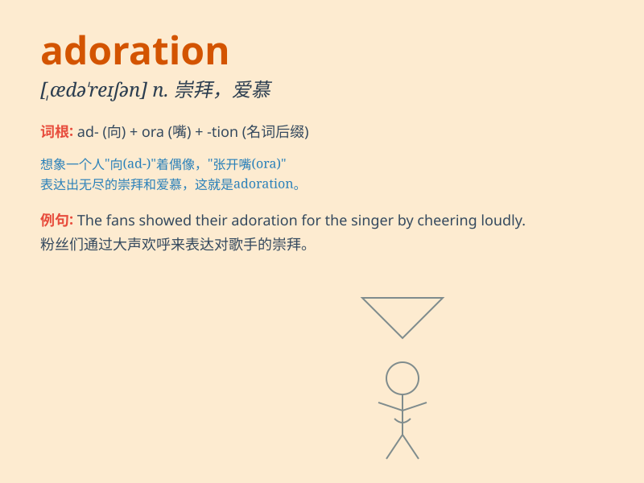

## adoration

**英音:** _[ædə\'reɪʃ(ə)n]_ **美音:** _[,ædə\'reʃən]_

**译义:** *n.崇拜,爱慕,受崇拜(或爱慕)的对象*

### 短语

+ **express adoration:** _表达爱慕_

+ **feel adoration:** _感到崇拜_

+ **inspire adoration:** _激起爱慕_

+ **mutual adoration:** _相互爱慕_

+ **profound adoration:** _深深的崇拜_

### 例句

#### 例句1

> **She looked at him with adoration in her eyes.**

**中文翻译:** 她用充满爱慕的眼神看着他。

**单词释义:** 爱慕；崇拜

#### 例句2

> **The fans\' adoration for the pop star was overwhelming.**

**中文翻译:** 粉丝们对这位流行歌星的崇拜之情势不可挡。

**单词释义:** 崇拜

#### 例句3

> **His adoration of nature led him to become a conservationist.**

**中文翻译:** 他对大自然的热爱使他成为了一名自然环境保护主义者。

**单词释义:** 热爱

### 背诵小故事

> A little girl was lost in a forest. When she was found by her
parents, their eyes showed adoration. They hugged her tightly, their
love and admiration for her evident. This made the girl feel truly
special.

**一个小女孩在森林里迷路了。当她被父母找到时，他们的眼中流露出爱慕。他们紧紧地拥抱她，对她的爱和赞赏显而易见。这让女孩感到自己特别珍贵。**

### 图义

