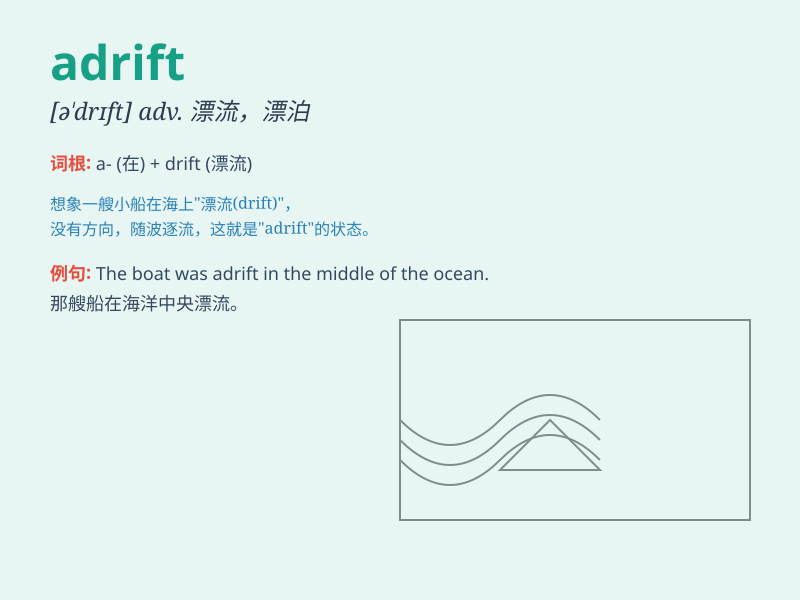

## adrift

**英音:** _[ə\'drɪft]_ **美音:** _[ə\'drɪft]_

**译义:** *adv.漂浮着,随波逐流地adj.漂泊的*

### 短语

+ **be adrift:** _漂流；漂泊_

+ **set adrift:** _使漂流；使漂泊_

+ **go adrift:** _（计划、想法等）偏离正轨；出岔子_

+ **drift adrift:** _漫无目的地漂流_

+ **leave sth adrift:** _使某物漂流_

### 例句

#### 例句1

> **The boat was adrift after the storm.**

**中文翻译:** 暴风雨过后，那艘船漂流着。

**单词释义:** 漂浮；漂流

#### 例句2

> **He felt adrift in a strange city without friends or family.**

**中文翻译:** 他在一个陌生的城市里，没有朋友和家人，感到无所适从。

**单词释义:** 漂泊；不知所措

#### 例句3

> **The survivors were adrift at sea for days.**

**中文翻译:** 幸存者们在海上漂流了好几天。

**单词释义:** 漂流；随波逐流

### 背诵小故事

> A small boat was adrift on the vast ocean. The wind blew it away from
its course. The sailors were lost and had no idea where they were going.
They were just floating aimlessly, like the word \'adrift\' means.

**一艘小船在广阔的海洋上漂流。风把它吹离了航线。水手们迷失了方向，不知道要去哪里。他们只是漫无目的地漂浮着，就像'adrift'这个词所表示的那样。**

### 图义

