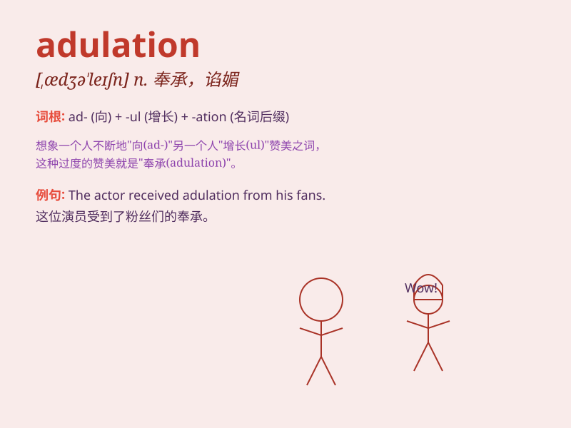

## adulation

**英音:** _[ædjʊ\'leɪʃ(ə)n]_ **美音:** _[,ædʒə\'leʃən]_

**译义:** *n.奉承,阿谀*

### 短语

+ **heap adulation upon:** _对\...大肆吹捧_

+ **excessive adulation:** _过度的奉承_

+ **court adulation:** _谋求奉承_

+ **shower adulation on:** _向\...大量奉承_

+ **resist adulation:** _抵制奉承_

### 例句

#### 例句1

> **The singer was tired of the constant adulation from her fans.**

**中文翻译:** 这位歌手厌倦了粉丝们持续不断的奉承。

**单词释义:** 奉承；谄媚

#### 例句2

> **He basked in the adulation of the crowd after his speech.**

**中文翻译:** 他在演讲结束后沉浸在人群的赞美之中。

**单词释义:** 称赞；恭维

#### 例句3

> **The politician was surrounded by sycophants offering
adulation.**

**中文翻译:** 这位政客被献媚者的奉承所包围。

**单词释义:** 阿谀；奉承

### 背诵小故事

> A young artist constantly received adulation from fans. But he
remained humble, knowing true success lies not just in praise but in
continuous improvement. One day, he realized that adulation can be both
encouraging and misleading.

**一位年轻的艺术家不断收到粉丝的阿谀奉承。但他保持谦逊，知道真正的成功不仅在于赞扬，还在于不断进步。有一天，他意识到阿谀奉承既可以是鼓舞也可能是误导。**

### 图义

