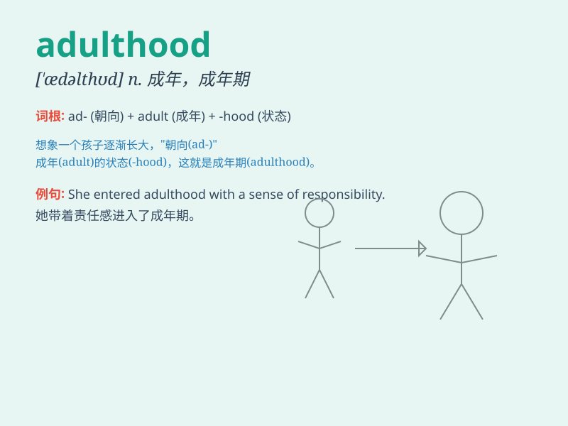

## adulthood

**英音:** _[\'ædʌlthʊd]_ **美音:** _[\'ædʌlthʊd]_

**译义:** *n.成人期*

### 短语

+ **reach adulthood:** _成年_

+ **enter adulthood:** _进入成年_

+ **adulthood experiences:** _成年经历_

+ **transition to adulthood:** _向成年过渡_

+ **adulthood responsibilities:** _成年责任_

### 例句

#### 例句1

> **He struggled to adapt to the responsibilities of adulthood.**

**中文翻译:** 他努力适应成年后的责任。

**单词释义:** 成年时期

#### 例句2

> **Adulthood brings new challenges and opportunities.**

**中文翻译:** 成年带来新的挑战和机遇。

**单词释义:** 成年时期

#### 例句3

> **She finally achieved financial independence in adulthood.**

**中文翻译:** 她在成年后终于实现了经济独立。

**单词释义:** 成年时期

### 背诵小故事

> Once upon a time, a young boy dreamed of the day he would reach
adulthood. He imagined having freedom and making his own choices.
Finally, he grew up and understood the responsibilities that came with
adulthood.

**从前，一个小男孩梦想着有一天能长大成人。他想象着拥有自由和自己做决定。最后，他长大了，也明白了成年所带来的责任。**

### 图义

