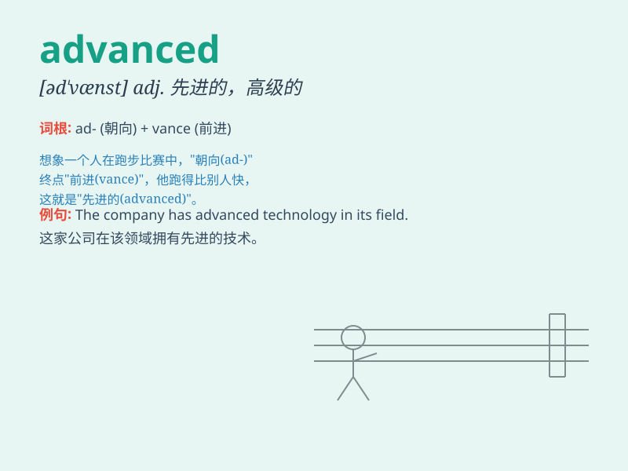

## advanced

**英音:** _[ədˈvɑ:nst]_ **美音:** _[əd\'vænst]_

**译义:** *adj.高级的,年老的,先进的*

### 短语

+ **advanced technology:** _先进技术_

+ **advanced level:** _高级水平_

+ **advanced course:** _高级课程_

+ **advanced age:** _高龄_

+ **advanced stage:** _晚期；高级阶段_

### 例句

#### 例句1

> **The technology used in this product is very advanced.**

**中文翻译:** 这个产品中使用的技术非常先进。

**单词释义:** 先进的

#### 例句2

> **She has advanced knowledge in the field of medicine.**

**中文翻译:** 她在医学领域有高深的知识。

**单词释义:** 高深的；高级的

#### 例句3

> **The troops advanced towards the enemy position.**

**中文翻译:** 部队向敌人的阵地前进。

**单词释义:** 前进；行进

### 背诵小故事

> A brave adventurer was on a journey. He faced many challenges and
learned new skills. With each step, he became more advanced in his
abilities and finally reached his destination.

**一位勇敢的冒险家在旅途中。他面临许多挑战并学习了新技能。每走一步，他的能力都变得更高级，最终到达了目的地。**

### 图义

