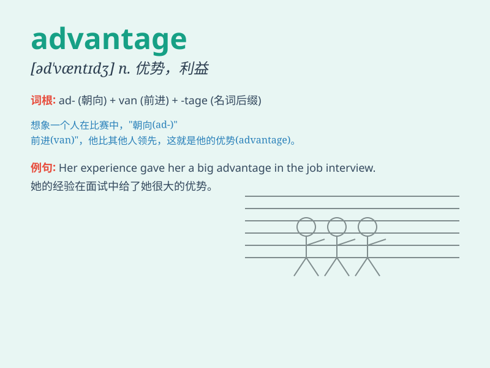

## advantage

**英音:** _[əd\'vɑːntɪdʒ]_ **美音:** _[əd\'væntɪdʒ]_

**译义:** *n.优势,有利条件,利益*

### 短语

+ **take advantage of:** _利用；占\...\...的便宜_

+ **competitive advantage:** _竞争优势_

+ **have the advantage of:** _有\...\...的优势_

+ **to one\'s advantage:** _对某人有利_

+ **advantage in sth.:** _在某方面的优势_

### 例句

#### 例句1

> **The advantage of living in a big city is the access to better
healthcare.**

**中文翻译:** 生活在大城市的优势在于能够获得更好的医疗保健。

**单词释义:** 优势；有利条件

#### 例句2

> **She has the advantage of a good education.**

**中文翻译:** 她具有受过良好教育的优势。

**单词释义:** 优势；有利条件

#### 例句3

> **His height gave him an advantage over the other players.**

**中文翻译:** 他的身高使他比其他运动员更有优势。

**单词释义:** 优势；有利条件

### 背诵小故事

> A poor boy was always bullied. One day, he discovered his talent for
painting and won a big competition. This talent became his advantage. He
was no longer looked down upon. Now he had the upper hand and a bright
future.

**一个贫穷的男孩总是被欺负。有一天，他发现了自己的绘画天赋并赢得了一场大型比赛。这个天赋成为了他的优势。他不再被人看不起。现在他占据了上风，拥有了光明的未来。**

### 图义

