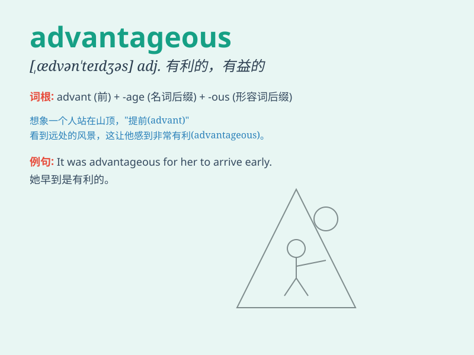

## advantageous

**英音:** _[ædvən\'teɪdʒəs]_ **美音:**
_[\'ædvən\'tedʒəs]_

**译义:** *adj.有利的*

### 短语

+ **advantageous position:** _有利地位_

+ **advantageous terms:** _有利条件；优惠条款_

+ **advantageous environment:** _有利环境_

+ **advantageous outcome:** _有利结果_

+ **advantageous situation:** _有利形势_

### 例句

#### 例句1

> **The new trade agreement is highly advantageous for our country\'s
economy.**

**中文翻译:** 新的贸易协定对我们国家的经济非常有利。

**单词释义:** 有利的

#### 例句2

> **Taking this route would be advantageous as it saves time.**

**中文翻译:** 走这条路线会是有利的，因为它节省时间。

**单词释义:** 有利的

#### 例句3

> **It is advantageous to have a good education when applying for
jobs.**

**中文翻译:** 在申请工作时，拥有良好的教育是有利的。

**单词释义:** 有利的

### 背诵小故事

> A young entrepreneur was struggling until he found an advantageous
partnership. With this new ally, his business grew rapidly. The
partnership gave him an edge, just like the meaning of \'advantageous\'
which means giving an advantage or being favorable.

**一位年轻的企业家一直在苦苦挣扎，直到他找到了一个有利的合作伙伴关系。有了这个新盟友，他的生意迅速增长。这种合作关系给了他优势，就像'advantageous'这个词的意思，指有利的，有优势的。**

### 图义

