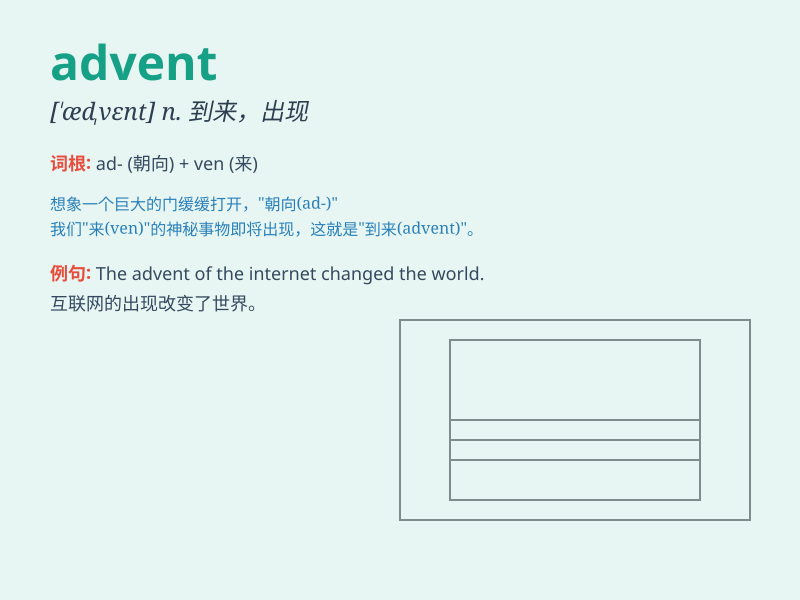

## advent

**英音:** _[ˈædvent]_ **美音:** _[ˈædvent]_

**译义:** *n.(尤指不寻常的人或事)出现,到来 (Advent)n. 基督降临
2降临节*

### 短语

+ **the advent of:** _...的出现；...的到来_

+ **Advent Sunday:** _降临节主日_

+ **Advent calendar:** _降临节日历_

+ **Advent season:** _降临节期_

+ **Advent wreath:** _降临节花环_

### 例句

#### 例句1

> **The advent of the internet has changed the way we
communicate.**

**中文翻译:** 互联网的出现改变了我们交流的方式。

**单词释义:** 出现；到来

#### 例句2

> **We are waiting for the advent of spring.**

**中文翻译:** 我们在等待春天的来临。

**单词释义:** 来临

#### 例句3

> **The advent of new technology has brought many benefits to our
lives.**

**中文翻译:** 新技术的出现给我们的生活带来了许多好处。

**单词释义:** 出现

### 背诵小故事

>
想象在一个古老的小镇，每年冬天人们都满怀期待。终于有一天，远处传来阵阵钟声，那是
Advent 的时刻，意味着重要的节日即将来临，大家欢呼雀跃。

**这个故事描述了人们期待重要时刻到来的情景，来辅助记忆'advent'这个词，它意为'到来；出现；来临'**

### 图义

