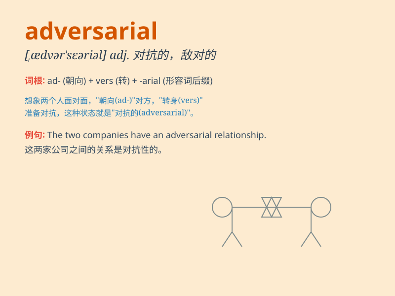

## adversarial

**英音:** _[,ædvə\'seərɪəl]_ **美音:** _[,ædvɚ\'sɛrɪəl]_

**译义:** *adj.敌手的,对手的,对抗(性)的*

### 短语

+ **adversarial relationship:** _敌对关系_

+ **adversarial system:** _对抗系统_

+ **adversarial approach:** _对抗性方法_

+ **adversarial environment:** _对抗环境_

+ **adversarial position:** _敌对立场_

### 例句

#### 例句1

> **The two companies have an adversarial relationship in the
market.**

**中文翻译:** 这两家公司在市场上存在敌对关系。

**单词释义:** 敌对的

#### 例句2

> **His adversarial attitude made it difficult to have a productive
discussion.**

**中文翻译:** 他的对抗态度使得进行富有成效的讨论变得困难。

**单词释义:** 对抗性的

#### 例句3

> **The adversarial legal system often leads to lengthy and costly
proceedings.**

**中文翻译:** 对抗式的法律制度常常导致冗长且昂贵的诉讼程序。

**单词释义:** 对抗的

### 背诵小故事

> In a magical forest, a brave knight faced an adversarial dragon. The
dragon was always ready to fight, showing an opposing and hostile
attitude. But the knight never gave up, determined to overcome this
adversarial challenge.

**在一个神奇的森林里，一位勇敢的骑士面对一条敌对的龙。这条龙总是准备战斗，呈现出对抗和充满敌意的态度。但骑士从未放弃，决心克服这个敌对的挑战。**

### 图义

