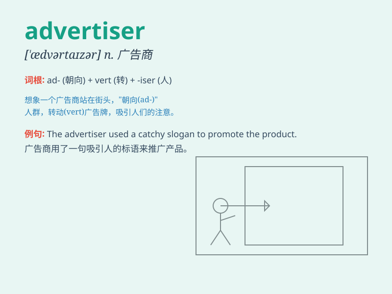

## advertiser

**英音:** _[ˈædvətaɪzə(r)]_ **美音:** _[ˈædvərtaɪzər]_

**译义:** *n.登广告者,广告客户*

### 短语

+ **online advertiser:** _在线广告商_

+ **major advertiser:** _主要广告商_

+ **local advertiser:** _本地广告商_

+ **professional advertiser:** _专业广告商_

+ **competitive advertiser:** _有竞争力的广告商_

### 例句

#### 例句1

> **The advertiser spent a lot of money on the new campaign.**

**中文翻译:** 这位广告商在新的宣传活动上花了很多钱。

**单词释义:** 广告商

#### 例句2

> **The advertiser came up with a creative idea to attract
customers.**

**中文翻译:** 这位广告商想出了一个有创意的点子来吸引顾客。

**单词释义:** 广告商

#### 例句3

> **We need to find a reliable advertiser for our product.**

**中文翻译:** 我们需要为我们的产品找一个可靠的广告商。

**单词释义:** 广告商

### 背诵小故事

> Once upon a time, there was a smart person who wanted to tell
everyone about his wonderful products. So, he became an advertiser,
spending money and using creative ideas to make his products known to
the world.

**从前，有一个聪明的人想要把他极好的产品告诉所有人。所以，他成为了一名广告商，花钱并用创意让他的产品被世界所知。**

### 图义

