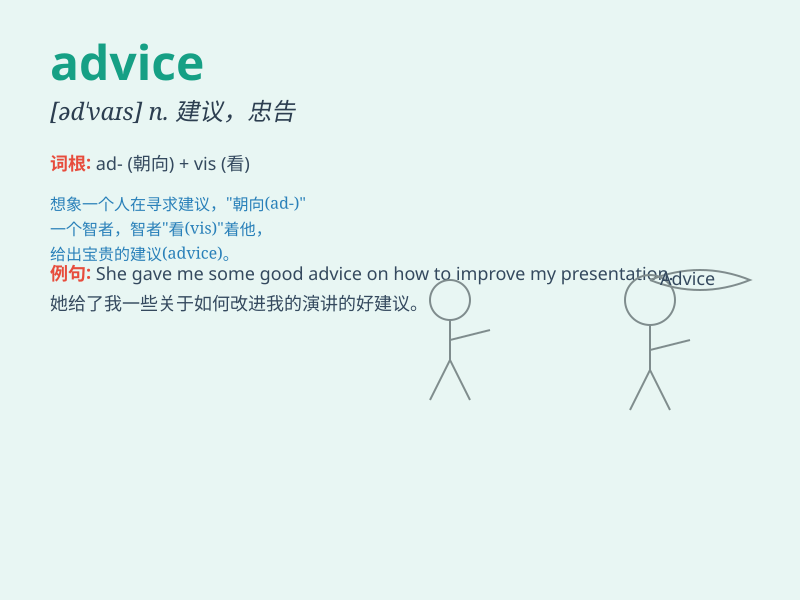

## advice

**英音:** _[əd\'vaɪs]_ **美音:** _[ədˈvaɪs]_

**译义:** *n.忠告,建议,[商]通知*

### 短语

+ **give advice:** _提出建议；给予劝告_

+ **take advice:** _接受建议；听从劝告_

+ **ask for advice:** _征求意见；寻求建议_

+ **good advice:** _好建议；良策_

+ **professional advice:** _专业建议；专业意见_

### 例句

#### 例句1

> **Could you give me some advice on how to learn English?**

**中文翻译:** 你能给我一些关于如何学习英语的建议吗？

**单词释义:** 建议

#### 例句2

> **I took my father\'s advice and decided to study harder.**

**中文翻译:** 我听从了父亲的建议，决定更努力地学习。

**单词释义:** 建议

#### 例句3

> **The doctor\'s advice was to rest for a few days.**

**中文翻译:** 医生的建议是休息几天。

**单词释义:** 建议

### 背诵小故事

> One day, Tom was in a dilemma. He didn\'t know which dress to choose
for the party. His friend gave him some advice and suggested the blue
one. With this advice, Tom made a great choice.

**一天，汤姆陷入了困境。他不知道该为聚会选哪条裙子。他的朋友给了他一些建议，建议选蓝色那条。有了这个建议，汤姆做出了很棒的选择。**

### 图义

