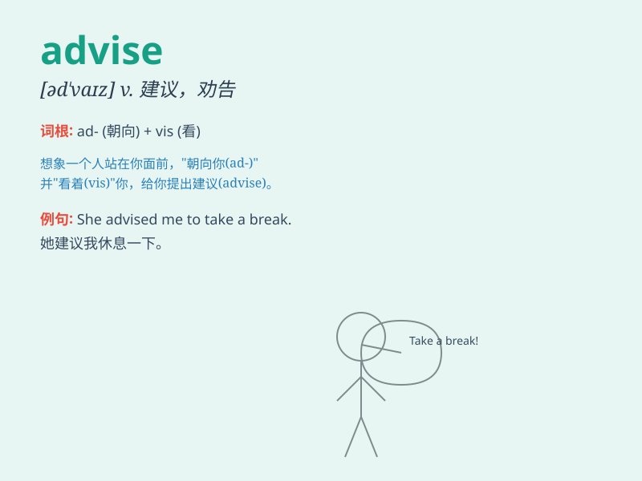

## advise

**英音:** _[əd\'vaɪz]_ **美音:** _[əd\'vaɪz]_

**译义:** *vt.劝告,忠告,警告,建议*

### 短语

+ **advise doing sth:** _建议做某事_

+ **advise sb to do sth:** _建议某人做某事_

+ **advise against sth/doing sth:** _劝某人不要做某事_

+ **advise on sth:** _就某事提供建议_

+ **be advised to do sth:** _被建议做某事_

### 例句

#### 例句1

> **I advise you to take a break.**

**中文翻译:** 我建议你休息一下。

**单词释义:** 建议

#### 例句2

> **The doctor advised me to exercise more.**

**中文翻译:** 医生建议我多锻炼。

**单词释义:** 建议

#### 例句3

> **Could you advise me on which book to read?**

**中文翻译:** 你能给我建议读哪本书吗？

**单词释义:** 建议；提供意见

### 背诵小故事

> One day, a wise old man advised the young boy to study hard. The boy
listened carefully and followed the advice. Later, he achieved great
success. The word \'advise\' means to give suggestions or offer
opinions.

**有一天，一位睿智的老人建议这个小男孩努力学习。小男孩认真倾听并听从了建议。后来，他取得了巨大的成功。单词\'advise\'意思是给出建议或提出意见。**

### 图义

