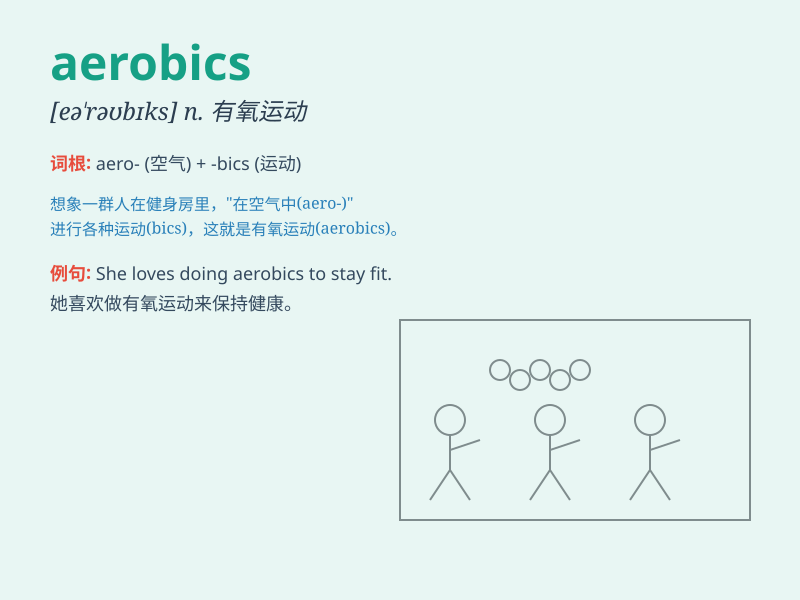

## aerobics

**英音:** _[eə\'rəʊbɪks]_ **美音:** _[ɛ\'robɪks]_

**译义:**
*n.有氧运动法,增氧健身法(指跑步,优越等增强心肺循环功能的运动)*

### 短语

+ **aerobics class:** _有氧健身班_

+ **aerobics exercise:** _有氧运动_

+ **aerobics instructor:** _有氧健身教练_

+ **aerobics routine:** _有氧健身操常规动作_

+ **do aerobics:** _做有氧运动_

### 例句

#### 例句1

> **I do aerobics three times a week to stay fit.**

**中文翻译:** 我每周做三次有氧运动来保持健康。

**单词释义:** 有氧运动

#### 例句2

> **Aerobics classes are very popular at the local gym.**

**中文翻译:** 有氧运动课程在当地的健身房很受欢迎。

**单词释义:** 有氧运动

#### 例句3

> **She is an instructor of aerobics.**

**中文翻译:** 她是一名有氧运动教练。

**单词释义:** 有氧运动

### 背诵小故事

>
想象一下，你在一个充满氧气的房间里欢快地跳跃、伸展。这就是'aerobics'（有氧运动），它能让你的心肺充满活力，就像给身体注入了新鲜的氧气，让你健康又快乐。

**想象你在充满氧气的房间里进行能让心肺充满活力的有氧运动，像注入新鲜氧气一样，助你健康快乐。**

### 图义

