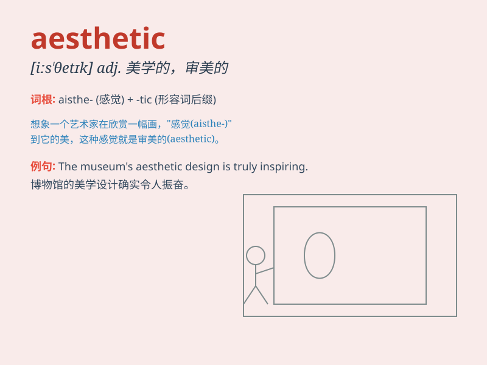

## aesthetic

**英音:** _[i:sˈθetɪk]_ **美音:** _[esˈθetɪk; ɛsˈθɛtɪk]_

**译义:** *adj.美学的,审美的,有审美感的*

### 短语

+ **aesthetic appeal:** _美学吸引力；审美魅力_

+ **aesthetic value:** _审美价值；美学价值_

+ **aesthetic experience:** _审美体验；美学经验_

+ **aesthetic judgment:** _审美判断；美学判断_

+ **aesthetic standard:** _审美标准；美学标准_

### 例句

#### 例句1

> **The new building has a very modern aesthetic.**

**中文翻译:** 这座新建筑具有非常现代的美学风格。

**单词释义:** 美学的；审美的

#### 例句2

> **She has an aesthetic appreciation of nature.**

**中文翻译:** 她对大自然有着审美上的欣赏。

**单词释义:** 审美的；美学方面的

#### 例句3

> **The design of the dress is based on aesthetic principles.**

**中文翻译:** 这件连衣裙的设计基于美学原则。

**单词释义:** 美学的

### 背诵小故事

> A painter was always seeking the aesthetic in his works. One day, he
saw a beautiful landscape and was inspired. He captured its essence and
created a masterpiece that was highly praised for its aesthetic appeal.

**一位画家一直在他的作品中寻求美感。有一天，他看到了一处美丽的风景并受到启发。他捕捉到其精髓，创作出一幅因其美学吸引力而备受赞誉的杰作。**

### 图义

