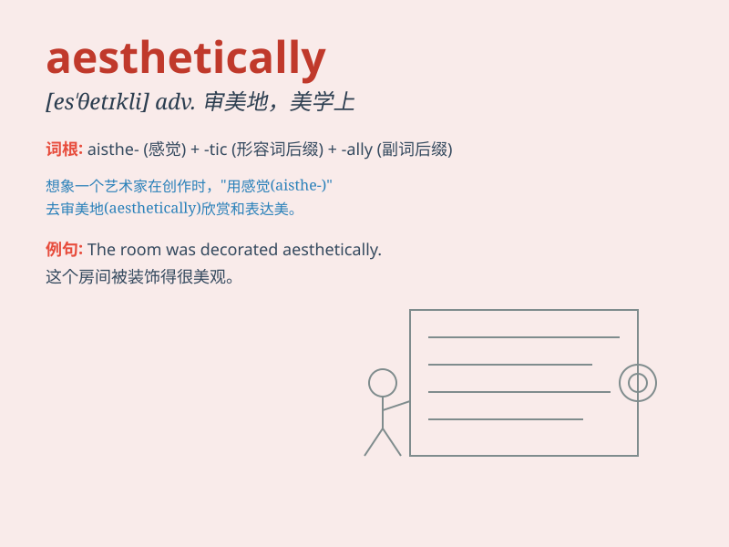

## aesthetically

**英音:** _[iːs\'θetɪkəlɪ]_ **美音:** _[ɛs\'θɛtɪkli]_

**译义:** *adv.审美地,美学观点上地*

### 短语

+ **aesthetically pleasing:** _美观的，令人愉悦的_

+ **aesthetically valuable:** _美学上有价值的_

+ **aesthetically oriented:** _以美学为导向的_

+ **aesthetically challenged:** _缺乏美感的_

+ **aesthetically harmonious:** _美学上和谐的_

### 例句

#### 例句1

> **The building is aesthetically pleasing, with its elegant design
and harmonious colors.**

**中文翻译:** 这座建筑在美学上令人愉悦，有着优雅的设计和和谐的色彩。

**单词释义:** 在美学上

#### 例句2

> **She decorated the room aesthetically to create a cozy
atmosphere.**

**中文翻译:** 她从美学角度装饰了房间，营造出舒适的氛围。

**单词释义:** 从美学角度

#### 例句3

> **The garden is aesthetically designed to attract visitors all year
round.**

**中文翻译:** 这个花园在美学方面经过精心设计，以全年吸引游客。

**单词释义:** 在美学方面

### 背诵小故事

> A painter was creating a masterpiece aesthetically. He carefully
chose colors and strokes, aiming to make the painting beautiful not just
functionally but aesthetically. His focus was on achieving a visually
pleasing and artistic effect.

**一位画家正在从美学角度创作一幅杰作。他精心挑选颜色和笔触，旨在让这幅画不仅在功能上，而且在美学上都很美。他专注于达到一种视觉上令人愉悦和艺术的效果。**

### 图义

