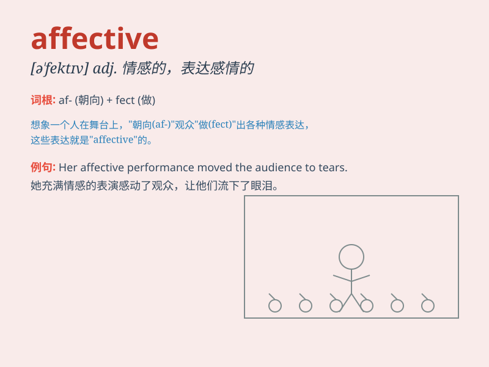

## affective

**英音:** _[ə\'fektɪv]_ **美音:** _[ə\'fɛktɪv]_

**译义:** *adj.情感的,表达感情的*

### 短语

+ **affective disorder:** _情感障碍；情绪病_

+ **affective domain:** _情感领域_

+ **affective response:** _情感反应_

+ **affective tone:** _情感基调_

+ **affective commitment:** _情感承诺_

### 例句

#### 例句1

> **The affective bond between mother and child is very strong.**

**中文翻译:** 母亲和孩子之间的情感纽带非常牢固。

**单词释义:** 情感的；感情方面的

#### 例句2

> **Affective disorders can have a significant impact on a person\'s
life.**

**中文翻译:** 情感障碍可能对一个人的生活产生重大影响。

**单词释义:** 情感的；感情方面的

#### 例句3

> **Music has an affective power that can soothe the soul.**

**中文翻译:** 音乐有一种能抚慰心灵的情感力量。

**单词释义:** 情感的；感情方面的

### 背诵小故事

> A young artist found that painting could express his affective
states. When he was happy, the colors were bright; when sad, they were
dull. Through this, he understood the meaning of \'affective\' - related
to emotions.

**一位年轻的艺术家发现绘画可以表达他的情感状态。当他开心时，色彩明亮；当他悲伤时，色彩暗淡。通过这个，他理解了"affective"这个词 -
与情感有关。**

### 图义

