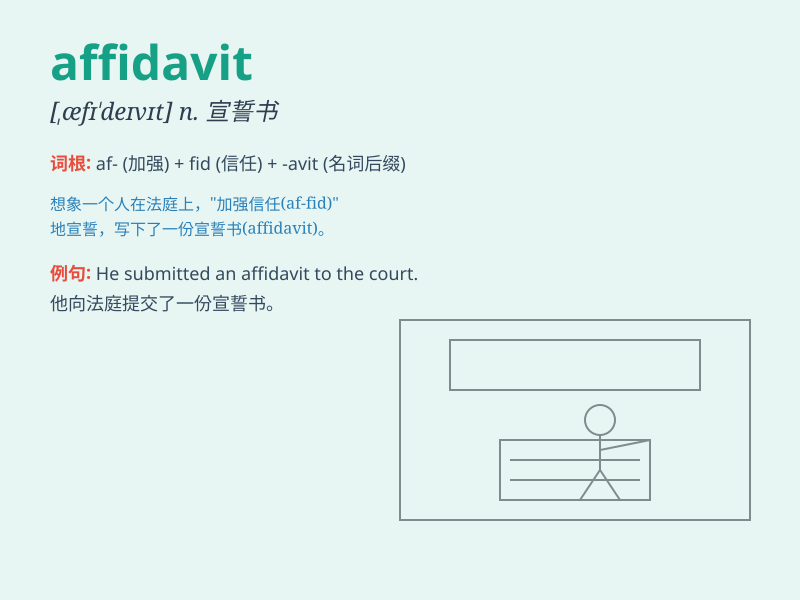

## affidavit

**英音:** _[,æfɪ\'deɪvɪt]_ **美音:** _[,æfə\'devɪt]_

**译义:**
*n.\<美>[律]宣誓书,(经陈诉者宣誓在法律上可采作证据的)书面陈述*

### 短语

+ **sworn affidavit:** _经宣誓的书面陈述_

+ **notarial affidavit:** _公证宣誓书_

+ **affidavit of support:** _经济担保宣誓书_

+ **affidavit of service:** _送达宣誓书_

+ **affidavit of identity:** _身份宣誓书_

### 例句

#### 例句1

> **The witness provided an affidavit to support the claim.**

**中文翻译:** 这位证人提供了一份宣誓书来支持这个主张。

**单词释义:** 宣誓书

#### 例句2

> **The court accepted the affidavit as evidence.**

**中文翻译:** 法庭接受这份宣誓书作为证据。

**单词释义:** 宣誓书

#### 例句3

> **He signed an affidavit stating the truth of the matter.**

**中文翻译:** 他签署了一份宣誓书，陈述事情的真相。

**单词释义:** 宣誓书

### 背诵小故事

> A detective was working on a case and needed an affidavIT. A witness
came forward and provided a detailed written statement, swearing it was
true. The affidavIT became crucial evidence.

**一位侦探正在处理一个案件，需要一份书面陈述。一位证人挺身而出，提供了一份详细的书面陈述，并宣誓其真实性。这份书面陈述成为了关键证据。**

### 图义

