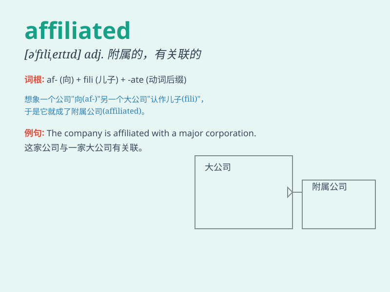

## affiliated

**英音:** _[ə\'fɪlɪeɪtɪd]_ **美音:** _[ə\'fɪlɪetɪd]_

**译义:** *adj.附属的,有关连的*

### 短语

+ **be affiliated with:** _与\...\...有关联；隶属于_

+ **affiliated company:** _附属公司_

+ **affiliated institution:** _附属机构_

+ **affiliated hospital:** _附属医院_

+ **affiliated school:** _附属学校_

### 例句

#### 例句1

> **The hospital is affiliated with a prestigious medical
university.**

**中文翻译:** 这家医院附属于一所著名的医科大学。

**单词释义:** 附属

#### 例句2

> **He is affiliated to the local football club.**

**中文翻译:** 他隶属于当地的足球俱乐部。

**单词释义:** 隶属于

#### 例句3

> **The research institute is closely affiliated with several leading
companies in the industry.**

**中文翻译:** 这个研究所与该行业的几家龙头公司密切关联。

**单词释义:** 关联

### 背诵小故事

>
想象一家大公司，它有很多小的分支。这些分支就像是孩子与母亲的关系，它们都与大公司
\'affiliated\'（关联、附属）。就像树枝和大树，紧密相连，不可分割。

**想象一家大公司和其众多分支的关联关系来辅助记忆'affiliated'，意思是关联、附属**

### 图义

