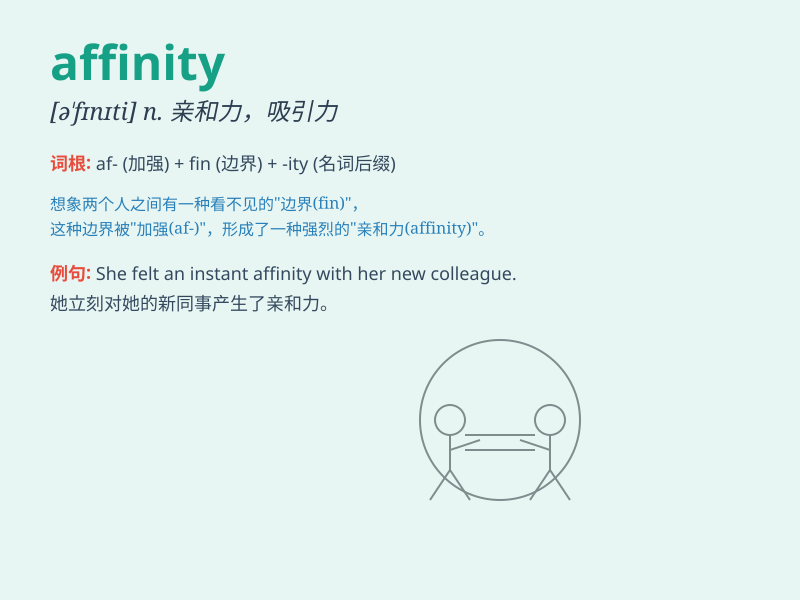

## affinity

**英音:** _[ə\'fɪnɪtɪ]_ **美音:** _[ə\'fɪnəti]_

**译义:** *n.密切关系,吸引力,姻亲关系,亲合力*

### 短语

+ **chemical affinity:** _化学亲和力_

+ **have an affinity for:** _对\...\...有亲和力；喜爱\...\..._

+ **affinity group:** _亲和团体；兴趣小组_

+ **electron affinity:** _电子亲合能_

+ **natural affinity:** _自然的亲和力_

### 例句

#### 例句1

> **She has an affinity for classical music.**

**中文翻译:** 她对古典音乐有喜爱。

**单词释义:** 喜爱；喜好

#### 例句2

> **There is a natural affinity between the two species.**

**中文翻译:** 这两个物种之间有一种天然的亲近关系。

**单词释义:** 亲近关系；类似

#### 例句3

> **His affinity with animals is remarkable.**

**中文翻译:** 他和动物的亲密关系很显著。

**单词释义:** 亲密关系

### 背诵小故事

> Once upon a time, a scientist was studying chemicals. He found that
some substances had a natural \'affinity\' to combine easily. It\'s like
they were drawn to each other, showing a special closeness and
attraction.

**从前，有一位科学家在研究化学物质。他发现某些物质有一种天然的"亲和力"，能轻易地结合在一起。就好像它们相互吸引，表现出特殊的亲密和吸引力。**

### 图义

