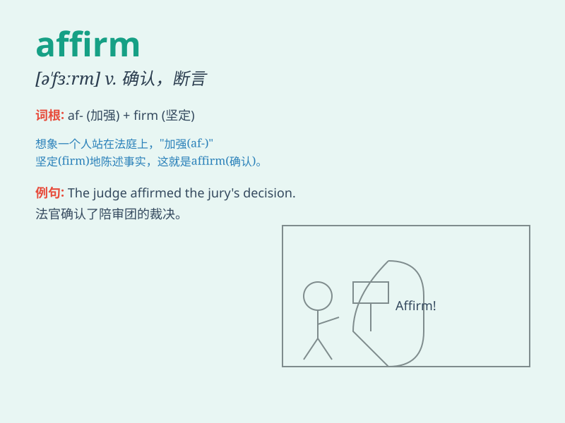

## affirm

**英音:** _[ə\'fɜːm]_ **美音:** _[ə\'fɝm]_

**译义:** *v.断言,确认,肯定*

### 短语

+ **affirm one\'s belief:** _肯定某人的信仰_

+ **affirm the decision:** _确认这个决定_

+ **affirm the truth:** _确认事实_

+ **affirm one\'s love:** _确认某人的爱_

+ **affirm the contract:** _确认合同_

### 例句

#### 例句1

> **The witness affirmed that she saw the thief.**

**中文翻译:** 这位证人确认她看到了那个小偷。

**单词释义:** 确认；证实

#### 例句2

> **He affirmed his love for her.**

**中文翻译:** 他肯定了他对她的爱。

**单词释义:** 肯定；断言

#### 例句3

> **The court affirmed the judgment.**

**中文翻译:** 法庭确认了该判决。

**单词释义:** 批准；认可

### 背诵小故事

> A firm boss was always confident. When asked about the company\'s
future, he would affirm positively that they would succeed. His firm
belief in success made the team work harder.

**一位坚定的老板总是充满自信。当被问及公司的未来时，他总会肯定地断言他们会成功。他对成功的坚定信念让团队更加努力工作。**

### 图义

