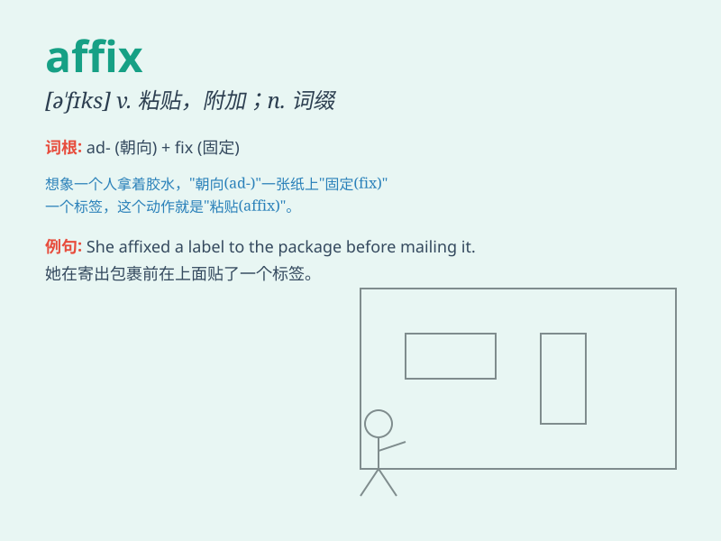

## affix

**英音:** _[ə\'fɪks]_ **美音:** _[ə\'fɪks]_

**译义:** *vt.使附于,粘贴n.[语]词缀*

### 短语

+ **affix a label:** _贴上标签_

+ **affix a seal:** _盖上印章_

+ **affix one\'s signature:** _签名_

+ **affix a stamp:** _贴上邮票_

+ **affix importance to:** _重视_

### 例句

#### 例句1

> **Please affix your signature at the bottom of the form.**

**中文翻译:** 请在表格底部签名。

**单词释义:** 贴上；签署

#### 例句2

> **The stamps were affixed to the envelopes.**

**中文翻译:** 邮票被贴在了信封上。

**单词释义:** 粘贴；附着

#### 例句3

> **They decided to affix a label to the package.**

**中文翻译:** 他们决定在包裹上贴一个标签。

**单词释义:** 附加；添加

### 背诵小故事

> 想象你是一个邮票收集者，每次得到新邮票，你都会小心地
affix（贴上）它们到集邮册里。这个动作就像把某个东西牢牢固定在一个位置，所以
affix 就是贴上、附加的意思。

**想象你是邮票收集者，小心贴上邮票的动作，来理解 affix
表示贴上、附加的意思。**

### 图义

