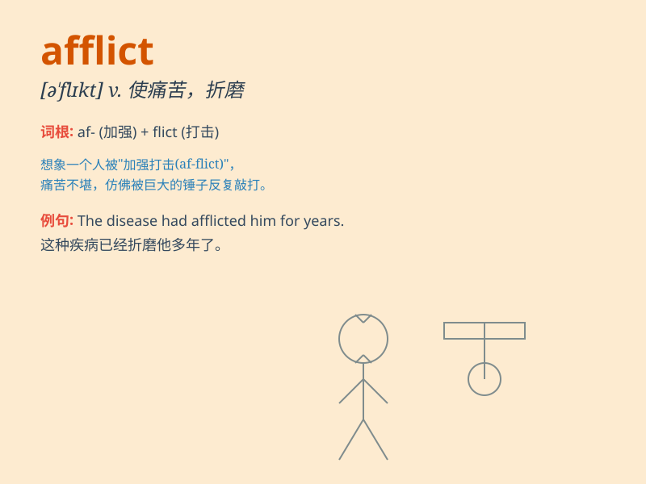

## afflict

**英音:** _[ə\'flɪkt]_ **美音:** _[ə\'flɪkt]_

**译义:** *vt.使痛苦,折磨*

### 短语

+ **be afflicted with:** _受\...\...折磨；患\...\...病_

+ **afflict sb. with sth.:** _使某人受某事之苦_

+ **afflictive pain:** _痛苦的疼痛_

+ **severely afflict:** _严重折磨_

+ **chronically afflict:** _长期折磨_

### 例句

#### 例句1

> **The disease afflicted thousands of people.**

**中文翻译:** 这种疾病折磨了成千上万的人。

**单词释义:** 使痛苦；折磨

#### 例句2

> **She was afflicted with severe back pain.**

**中文翻译:** 她深受严重背痛的折磨。

**单词释义:** 使遭受；使受苦

#### 例句3

> **Poverty has afflicted this region for years.**

**中文翻译:** 多年来，贫困一直困扰着这个地区。

**单词释义:** 困扰；给\...造成痛苦

### 背诵小故事

> A poor knight was constantly afflicted by evil magic. Every day, he
suffered from various pains and hardships. But he never gave up,
determined to break the curse. Afflict means to cause pain or suffering
to someone.

**一个可怜的骑士一直被邪恶的魔法所折磨。每天，他都遭受着各种痛苦和艰难。但他从未放弃，决心打破诅咒。afflict
意思是使某人遭受痛苦或苦难。**

### 图义

