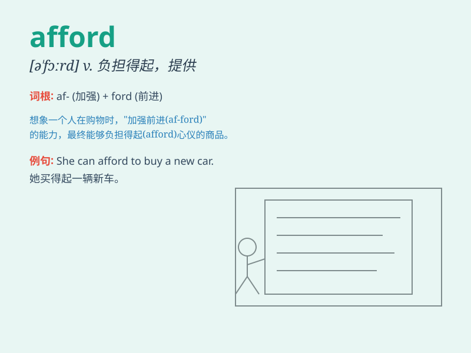

## afford

**英音:** _[ə\'fɔːd]_ **美音:** _[ə\'fɔrd]_

**译义:** *vt.提供,给予,供应得起,*

### 短语

+ **afford to do sth:** _有经济条件做某事；负担得起做某事_

+ **afford sth:** _买得起某物；承担得起某物_

+ **can\'t afford to do sth:** _负担不起做某事；不能做某事_

+ **afford the expense:** _承担得起费用_

+ **afford an opportunity:** _提供机会_

### 例句

#### 例句1

> **I can\'t afford to buy a new car.**

**中文翻译:** 我买不起一辆新车。

**单词释义:** 有足够的钱（做某事）

#### 例句2

> **They can afford to send their children to private schools.**

**中文翻译:** 他们有能力送孩子上私立学校。

**单词释义:** 有经济条件承担

#### 例句3

> **We can\'t afford the time to wait any longer.**

**中文翻译:** 我们抽不出时间再等了。

**单词释义:** 有足够的时间（做某事）

### 背诵小故事

> One day, Tom saw a beautiful guitar in a store. He really wanted it
but was worried. Then he realized his savings could afford it. He was so
happy and bought the guitar.

**一天，汤姆在一家商店看到一把漂亮的吉他。他非常想要但很担心。然后他意识到他的积蓄能够买得起。他非常高兴并买了那把吉他。**

### 图义

