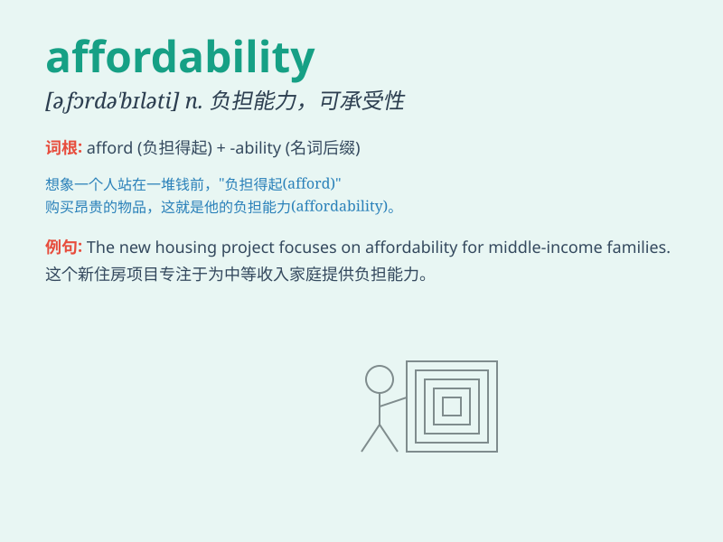

## affordability

**英音:** _[əˌfɔːrdəˈbɪlɪti]_ **美音:**
_[əˌfɔːrdəˈbɪlɪti]_

**译义:** *n. 负担能力；支付能力；可购性*

### 短语

+ **housing affordability:** _住房可负担性_

+ **affordability crisis:** _可负担能力危机_

+ **affordability index:** _可负担性指数_

+ **improve affordability:** _提高可负担性_

+ **affordability gap:** _可负担能力差距_

### 例句

#### 例句1

> **The affordability of housing has become a major concern in many
cities.**

**中文翻译:** 住房的可负担性在许多城市已成为一个主要问题。

**单词释义:** 可负担性；承受能力

#### 例句2

> **We need to improve the affordability of healthcare for all
citizens.**

**中文翻译:** 我们需要提高所有公民医疗保健的可负担性。

**单词释义:** 可负担性；承受能力

#### 例句3

> **The new policy aims to enhance the affordability of
education.**

**中文翻译:** 新政策旨在增强教育的可负担性。

**单词释义:** 可负担性；承受能力

### 背诵小故事

> A poor student wanted to buy a laptop but worried about
affordability. Then he found a part-time job and saved money. Finally,
he could afford the laptop he needed.

**一个贫困的学生想买一台笔记本电脑，但担心支付能力。然后他找了一份兼职工作并攒钱。最终，他能够买得起他需要的笔记本电脑。**

### 图义

