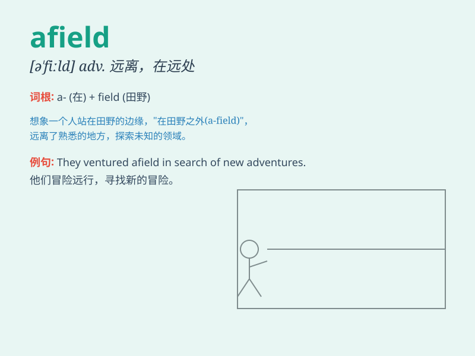

## afield

**英音:** _[ə\'fiːld]_ **美音:** _[ə\'fild]_

**译义:** *adv.离开(家乡),在战场上,在田野*

### 短语

+ **far afield:** _远离；遥远_

+ **wide afield:** _广泛地；大范围地_

+ **travel afield:** _到外地旅行_

+ **venture afield:** _冒险去远处_

+ **stray afield:** _走失；迷路；偏离正道_

### 例句

#### 例句1

> **He has traveled far afield.**

**中文翻译:** 他已经到远方旅行过。

**单词释义:** 在远方

#### 例句2

> **Don\'t wander too far afield or you\'ll get lost.**

**中文翻译:** 别走到太远的地方，否则你会迷路的。

**单词释义:** 远离

#### 例句3

> **Her research took her afield from her usual subject.**

**中文翻译:** 她的研究使她离开了通常的课题。

**单词释义:** 偏离

### 背诵小故事

> A young adventurer set off on a journey far afield. He left his
hometown and explored unknown lands. Along the way, he faced many
challenges but never gave up. \'Afield\' means far away from home or in
distant places.

**一位年轻的冒险家踏上了远方的旅程。他离开了家乡，去探索未知的土地。一路上，他面临许多挑战，但从未放弃。'afield'意思是远离家乡或在遥远的地方。**

### 图义

