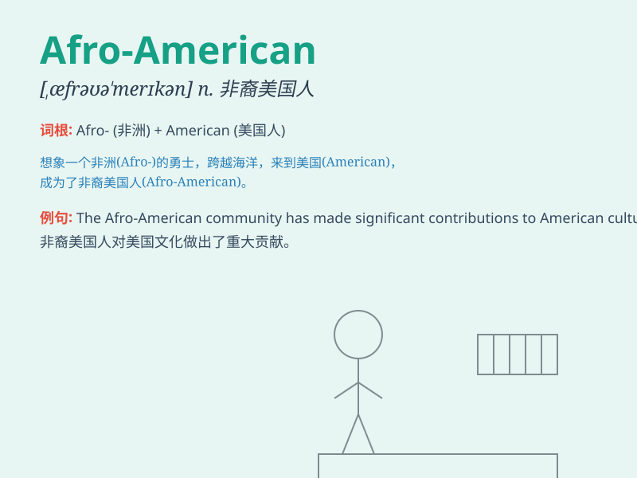

## Afro-American

**英音:** _[ˈæfrəʊ əˈmerɪkən]_ **美音:** _[ˈæfroʊ
əˈmɛrɪkən]_

**译义:** *n. 非裔美国人（指美国黑人）*

### 短语

+ **Afro-American culture:** _非裔美国人文化_

+ **Afro-American literature:** _非裔美国文学_

+ **Afro-American music:** _非裔美国音乐_

+ **Afro-American history:** _非裔美国人历史_

+ **Afro-American art:** _非裔美国艺术_

### 例句

#### 例句1

> **The Afro-American community has made significant contributions to
American culture.**

**中文翻译:** 非裔美国人社区为美国文化做出了重大贡献。

**单词释义:** 非裔美国人

#### 例句2

> **Many Afro-American artists have gained international
recognition.**

**中文翻译:** 许多非裔美国艺术家获得了国际认可。

**单词释义:** 非裔美国人

#### 例句3

> **The history of Afro-American struggles for equality is a long and
challenging one.**

**中文翻译:** 非裔美国人争取平等的历史漫长而充满挑战。

**单词释义:** 非裔美国人

### 背诵小故事

> Once upon a time, there was a person named Tom. He was an
Afro-American. He faced many challenges but was proud of his heritage.
His strength and determination showed the spirit of Afro-American
people.

**从前，有个人叫汤姆。他是一位非裔美国人。他面临许多挑战，但为自己的传统感到骄傲。他的力量和决心展现了非裔美国人的精神。**

### 图义

