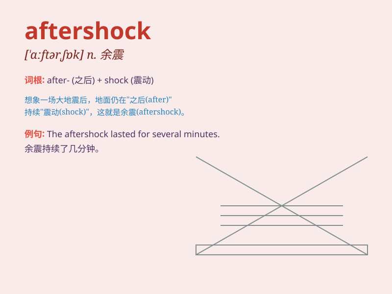

## aftershock

**英音:** _[\'ɑːftəʃɒk]_ **美音:** _[\'æftəʃɑk]_

**译义:** *n.余震*

### 短语

+ **major aftershock:** _大余震_

+ **powerful aftershock:** _强烈余震_

+ **aftershock sequence:** _余震序列_

+ **frequent aftershocks:** _频繁的余震_

+ **aftershock hazard:** _余震危害_

### 例句

#### 例句1

> **The area was still experiencing aftershocks several days after
the main earthquake.**

**中文翻译:** 在主震发生几天后，该地区仍在经历余震。

**单词释义:** 余震

#### 例句2

> **The aftershock caused further damage to the already weakened
buildings.**

**中文翻译:** 余震对已经脆弱的建筑物造成了进一步的破坏。

**单词释义:** 余震

#### 例句3

> **People were on edge, fearing another powerful aftershock.**

**中文翻译:** 人们处于紧张状态，担心再次发生强烈的余震。

**单词释义:** 余震

### 背诵小故事

> A brave scientist was studying earthquakes. After a big quake, there
were smaller tremors. The scientist called them \'aftershocks\'. These
aftershocks were like the echoes of the main quake, causing more fear
and damage.

**一位勇敢的科学家正在研究地震。在一次大地震后，出现了较小的震动。这位科学家把它们称为"余震"。这些余震就像主震的回声，造成了更多的恐惧和破坏。**

### 图义

