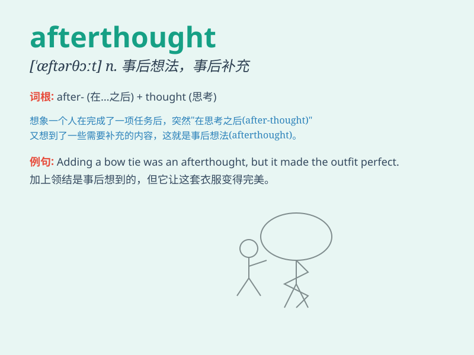

## afterthought

**英音:** _[\'ɑːftəθɔːt]_ **美音:** _[\'æftəθɔt]_

**译义:** *n.事后产生的想法,追悔,再思*

### 短语

+ **an afterthought:** _事后的想法；事后才想到的事物_

+ **come as an afterthought:** _作为事后的想法出现_

+ **be added as an afterthought:** _作为事后的补充被添加_

+ **treat something as an afterthought:**
_把某事当作事后的想法对待_

+ **mere afterthought:** _纯粹的事后想法_

### 例句

#### 例句1

> **The new feature was an afterthought and not well integrated into
the system.**

**中文翻译:** 这个新功能是事后才想到的，并且没有很好地整合到系统中。

**单词释义:** 事后才想到的想法或事物

#### 例句2

> **His apology seemed like an afterthought, coming long after the
damage was done.**

**中文翻译:** 他的道歉似乎是事后才想到的，在造成伤害很久之后才来。

**单词释义:** 事后的想法；事后的道歉

#### 例句3

> **The decoration was an afterthought and didn\'t match the overall
style of the room.**

**中文翻译:** 这些装饰是事后才想到的，与房间的整体风格不匹配。

**单词释义:** 事后添加的东西

### 背诵小故事

> One day, Tom planned a party. After everything was done, he suddenly
realized he forgot to invite his best friend. This realization was an
afterthought. It made him feel bad.

**一天，汤姆计划了一个聚会。一切都完成后，他突然意识到他忘了邀请他最好的朋友。这个意识就是事后的想法。这让他感觉很不好。**

### 图义

